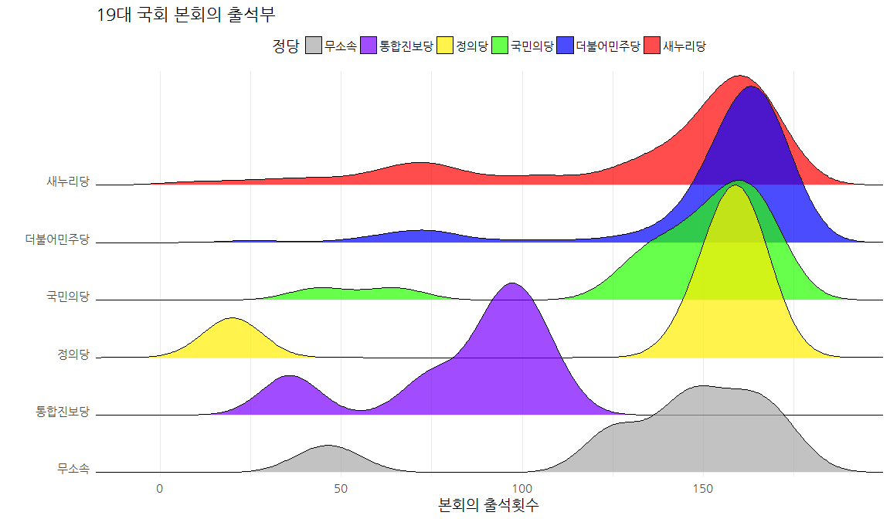
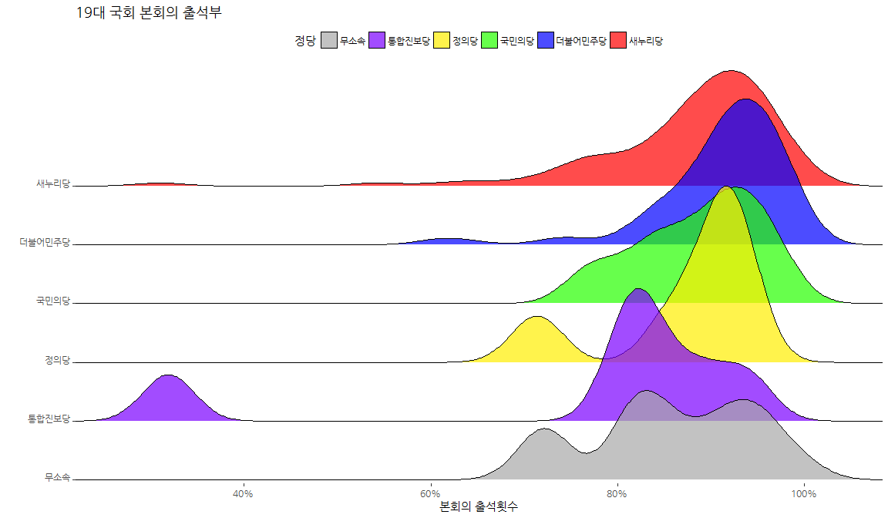

# 데이터 과학

## 1. 국회의원 출석부 [^lawmaker-roll-book] [^kbu-news] [^roll-book-stat]

[^lawmaker-roll-book]: [의정활동 기본 중의 기본! 19대 의원 본회의 출석률 공개 - 19대 국회 의원별 4년간(2012년~2016년)의 출석률은?](http://www.peoplepower21.org/Politics/1447566)
[^kbu-news]: [김병욱 국회의원, 대한민국 의정대상 수상](http://www.nspna.com/news/?mode=view&newsid=231325)
[^roll-book-stat]: [본회의 100% 출석의원 10명 중 1명뿐 - 20대 국회 출석률 분석, 80%미만 25명, 중진 많아, 민주당 양호, 한국당 불량](http://www.naeil.com/news_view/?id_art=245435)

[열려라국회 - 19대 국회 본회의 출석부](https://docs.google.com/spreadsheets/d/1AatiPKNryJ3z19MLOcTRyRaxXLf36Y1hkZptXT7H0t8/edit#gid=0)가 공개된지 얼마 되지 않았지만,
아직 20대 절반도 지나지 않은 상태에서 의정활동 기본인 본회의 출석률이 공개되어 기사화되고 있다.

## 2. 정당별 국회의원 출석부 시각화

다양한 방법이 가능하지만, 최근 많은 관심을 받고 있는 [joyplot](https://blogs.scientificamerican.com/sa-visual/pop-culture-pulsar-the-science-behind-joy-division-s-unknown-pleasures-album-cover/)은 
Jenny Bryan 교수가 2017년 4월 "Joy Plot"이라고 명명하면서 이름지어졌지만 1979년 Joy Division이 시초로 볼 수 있다.
[ggjoy](https://github.com/clauswilke/ggjoy)에서 관련된 자세한 정보를 얻을 수 있다.

### 2.1. 환경설정

참여연대 [열려라국회 - 19대 국회 본회의 출석부](https://docs.google.com/spreadsheets/d/1AatiPKNryJ3z19MLOcTRyRaxXLf36Y1hkZptXT7H0t8/edit#gid=0) 데이터가 
구글시트(googlesheets)로 작성되어 있어, 바로 데이터를 불러오기 위해서 팩키지를 설치한다. 그리고 `ggjoy` 팩키지를 설치하여 joyplot을 작성할 수 있도록 한다.    

~~~{.r}
# install.packages("googlesheets")
library(googlesheets)
library(tidyverse)
library(stringr)
library(forcats)
# devtools::install_github("clauswilke/ggjoy")
library(ggplot2)
library(ggjoy)
library(ggthemes)
library(extrafont)
loadfonts()
~~~

### 2.2. 데이터 정제

구글시트 중 참여연대에서 작성하여 공개한 19대 국회 본회의 출석부 데이터를 불러온다.
그리고 엑셀과 마찬가지로 관련있는 시트만 뽑아서 데이터프레임으로 저장한다.
민주당명을 갖는 국회의원이 2명 있어 이를 더불어민주당에 합쳐 데이터를 깔끔히 처리한다.

~~~{.r}
glist <- gs_ls()

gs_19 <- gs_title("[열려라국회] 19대 국회 본회의 출석부")

parli_gs <- gs_read(ss=gs_19, ws = "출석부", skip=7)

parli_gs <- parli_gs %>% filter(정당 !="비고") %>% 
    mutate(출석률 = as.numeric(str_replace(`출석률\n(출석/전체)`, "%", ""))/100) %>% 
    mutate(정당 = case_when(
        정당 %in% c("민주당", "민주당\n(현 더불어민주당)") ~ "더불어민주당",
        TRUE ~ 정당
    )) %>% 
    mutate(정당 = fct_rev(factor(정당, levels=c("새누리당", "더불어민주당", "국민의당", "정의당", "통합진보당", "무소속"))))

parli_gs %>% select(-출석률) %>% 
    DT::datatable()
~~~

## 3. 국회의원 출석현황 시각화

각 당의대표 색상을 찾아 변수로 저장한 후에, 출석건수를 각 정당별로 시각화한다.

~~~{.r}
party_colors <- c("#a8a8a8", "#7b00ff", "#ffee00", "#26ff00", "#0000ff", "#ff0000")

ggplot(parli_gs, aes(x = 출석, y = 정당, fill=정당)) +
    geom_joy(scale = 3, alpha=0.7) + 
    theme_minimal(base_size = 14, base_family = "NanumGothic") + 
    theme(axis.text.y = element_text(vjust = 0),
          legend.position = "top",
          legend.box = "horizontal",
          legend.direction = "horizontal") +
    labs(x="본회의 출석횟수", y="", title="19대 국회 본회의 출석부") +
    scale_y_discrete(expand = c(0.01, 0)) +   
    scale_x_continuous(expand = c(0, 0)) +
    scale_fill_manual(values= party_colors) +
    guides(fill = guide_legend(nrow = 1))
~~~

상기 시각화 결과를 보면 통합진보당이 해산되어 출석횟수가 현저히 줄어들게 되어 이를 출석률을 비교하는 것이 더 의미가 있을 수 있다.

~~~{.r}
ggplot(parli_gs, aes(x = 출석률, y = 정당, fill=정당)) +
    geom_joy(scale = 3, alpha=0.7) + 
    theme_tufte(base_family = "NanumGothic") + 
    theme(axis.text.y = element_text(vjust = 0),
          legend.position = "top",
          legend.box = "horizontal",
          legend.direction = "horizontal") +
    labs(x="본회의 출석횟수", y="", title="19대 국회 본회의 출석부") +
    scale_y_discrete(expand = c(0.01, 0)) +   
    scale_x_continuous(labels = scales::percent, expand = c(0, 0)) +
    scale_fill_manual(values= party_colors) +
    guides(fill = guide_legend(nrow = 1))
~~~

