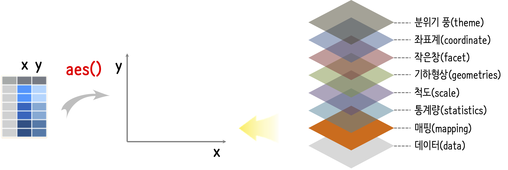
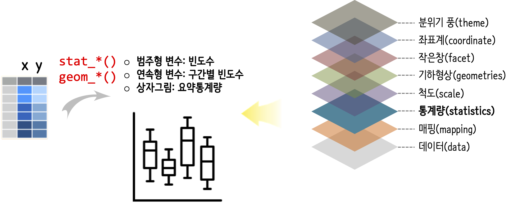
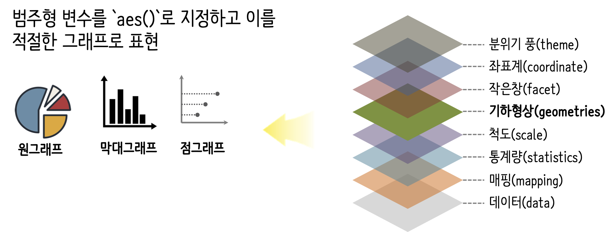
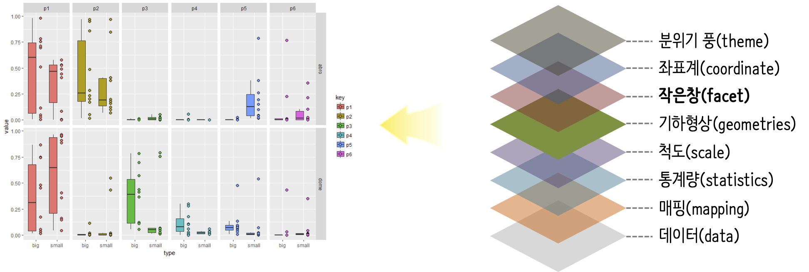
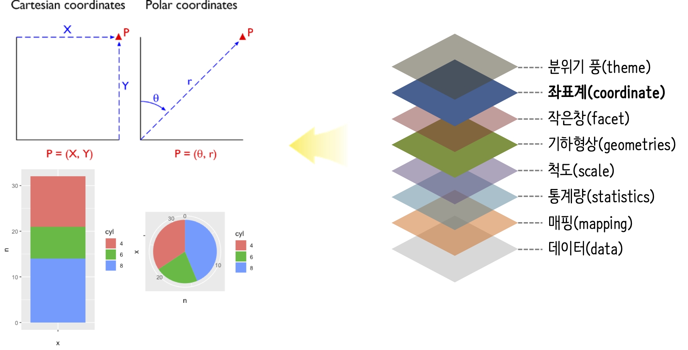
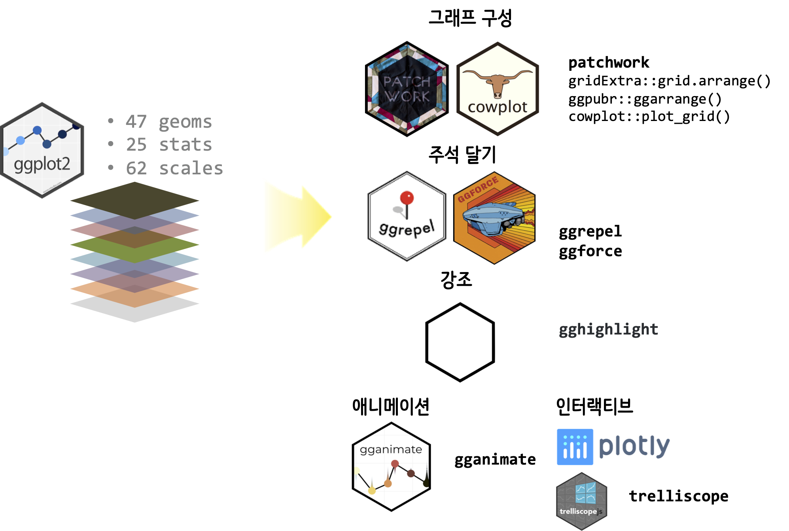

```{r setup, include=FALSE}
knitr::opts_chunk$set(echo = TRUE, message=FALSE, warning=FALSE,
                      comment="", digits = 3, tidy = FALSE, prompt = FALSE, fig.align = 'center')
```


# 그래프 문법의 존재이유 {#why-ggplot2}

Leland Wilkinson의 "The Grammar of Graphics"는 1999년 첫 출간된 이유 데이터 그래픽(data graphics)에 많은 영향을 주어 `ggplot2`, Polaris &rarr; Tableau, Vega-Lite 등의 형태로 우리곁에 다가섰다. 기존 데이터를 시각화한 다양한 그래픽 객체를 만드려면 각 그래픽 객체별로 따로 사용법을 익혀야만 되었다. 이를 일반화한 무언가 필요하는데 데이터 그래픽 객체를 분해해서 8개 계층으로 분해하여 조립하게 되면 데이터를 가장 잘 표현할 수 있는 그래프를 생성할 수 있고 **그래프 문법(grammar of graphics)**을 통해 이를 가능하게 되었다.


# 한단계 더 들어갑니다. {#ggplot2-steps}

## 데이터(Data) {#ggplot2-steps-data}

그래프 문법 `ggplot`에 데이터는 깔끔한 데이터(tidy data)를 가정한다. 이를 위해서 기존 `wide`형태 데이터는 key-value `long` 형태로 바뀌어 준비한다.


## 매핑(Mapping) {#ggplot2-steps-mapping}

깔끔한 데이터가 준비되면 다음 단계로 칼럼에 해당되는 각 변수를 `aes()` 함수를 사용해서 `aes(x=x, y=y, color=z, ...)`와 같은 방식으로 데이터와 그래프를 매핑한다.



## 통계량(statistics) {#ggplot2-steps-statistics}

범주형 그래프를 시각화할 경우 빈도수를 통계량으로 계산해놔야 하고, 연속형 변수를 히스토그램으로 표현할 때도 마찬가지 방식으로 구간별 빈도수를 계산해놔야 하고, 특히 상자그림(boxplot)을 시각화할 경우 각 분위수는 물론이고 중위수도 및 interquantile도 계산해서 수염의 끝도 계산해놔야 제대로된 상자그림을 시각화할 수 있다.




## 척도(scales) {#ggplot2-steps-scales}

X축, Y축의 척도를 그래프에서 자동으로 인식하는데는 한계가 있어 이를 필요한 경우 적절한 형태로 설정한다. `scale_<x, y, color, fill, ...>_<유형>()` 구문을 갖는다. 예를 들어 Y축을 담당하는 변수가 로그척도(log)가 적합한 경우 이를 `scale_y_log10()`와 같이 변수를 특성을 반영한 척도를 설정한다. 변수가 날짜나 시간인 경우 `scale_x_date()`, `scale_x_datetime()`을 활용하여 적절한 형태로 설정한다.


## 기하형상(geometries) {#ggplot2-steps-geometries}

예를 들어, 범주형 변수를 `aes()`로 지정하고 이를 적절한 그래프로 표현하기 위한 결정과정으로 `geom_*()` 방식으로 원그래프, 막대그래프, 점그래프 등으로 변수를 시각화객체로 지정한다.




## 작은 창(facet) {#ggplot2-steps-facet}

원본 데이터를 그룹으로 쪼개 작은 창에 동일한 시각화 객체를 표현하는 방법으로 다차원 데이터를 차원별로 나눠 볼 수 있다. 중요한 점은 각 작은 창이 동일한 유형의 그래프라는 점이 중요하다.




## 좌표계(coordinate) {#ggplot2-steps-coordinate}

깔끔한 데이터를 그래프에 매칭하여 시각화한 후에 경우에 따라서 좌표계를 변경할 경우가 있다. `coord_fixed()`, `coord_polar()`, `coord_flip()` 등을 사용해서 특정 영역 확대, 데카르트 좌표계에서 극좌표계, X-Y 축 변경 등의 작업을 수행할 수 있다.



```{r ggplot-coordinate}
library(tidyverse)

cartesian_g <- mtcars %>% 
  mutate(cyl = as.factor(cyl)) %>% 
  count(cyl) %>%
  ggplot(aes(x="", y=n, fill=cyl)) +
    geom_bar(position = "stack", stat = "identity")

polar_g <- mtcars %>% 
  mutate(cyl = as.factor(cyl)) %>% 
  count(cyl) %>% 
  ggplot(aes(x="", y=n, fill=cyl)) +
    geom_col() +
    coord_polar("y", start = 0)

gridExtra::grid.arrange(cartesian_g, polar_g, nrow=1)
```


## 분위기 풍(theme) {#ggplot2-steps-theme}

분위기 풍(theme)은 앞선 깔끔한 데이터를 시각화 객체로 변환시키는 과정과 아무런 연관이 없다. 대신 외양을 보기좋게 하는 역할을 수행한다. 즉, 시각화에 알맞는 색상 팔레트를 적용시키고, 글꼴을 바꾸는 작업이 여기에 해당된다.


```{r ggplot-theme}
library(ggthemes)

default_g <- mtcars %>% 
  ggplot(aes(x=disp, y=mpg)) +
    geom_point()

tufte_g <- mtcars %>% 
  ggplot(aes(x=disp, y=mpg)) +
    geom_point() +
    theme_tufte()

gridExtra::grid.arrange(default_g, tufte_g, nrow=1)
```


# `ggplot` 확장 {#ggplot2-steps-extension}



