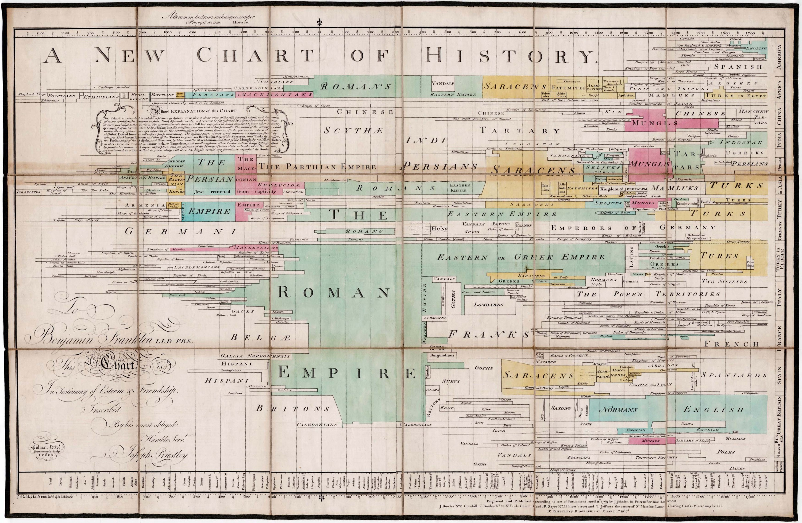
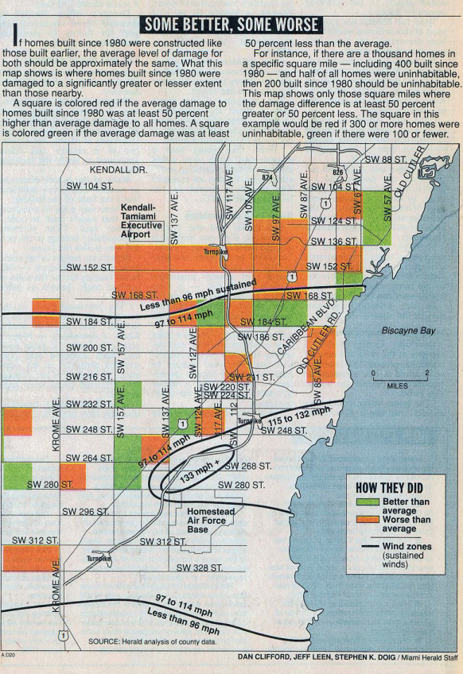

```{r  include = FALSE}
source("tools/chunk-options.R")

knitr::opts_chunk$set(echo = TRUE, warning=FALSE, message=FALSE,
                    comment="", digits = 3, tidy = FALSE, prompt = TRUE, fig.align = 'center')

library(ggplot2)
library(maps)
library(mapproj)
library(HistData) #  데이터
````


역사에 길이 남을 기념비적인 시각화 역작을 살펴보자. [^data-visualization-of-all-time]

[^data-visualization-of-all-time]: [Tableau Software(2012), The 5 most influential data visualizations of all time](https://www.slideshare.net/TableauSoftware/the-5-most-influential-data-visualizations-of-all-time)

1. Chart of Biography – Joseph Priestley 
1. War Mortality – Florence Nightingale
1. March on Moscow – Charles Minard
1. Gapminder – Rosling
1. London Cholera Map – John Snow


# 나폴레옹 러시아 침공 {#march-on-moscow}

[나폴레옹 러시아 침공](https://en.wikipedia.org/wiki/French_invasion_of_Russia)을 [Charles Joseph Minard](https://en.wikipedia.org/wiki/Charles_Joseph_Minard)가
시각화한 산출물이 첫손에 꼽는 시각화 역작이다.


``` {r viz-minard}
library(ggplot2)
library(maps)
library(mapproj)
library(HistData) #  데이터
```

나폴레옹 군대 러시아 침공 데이터를 `HistData`에서 얻는다. 
위도경도 정보가 있기 때문에 이를 지도에 투영하여 시각화는데 공격(A)과 퇴각(R)을 색상으로 구분하고 
생존 군인수를 굵기를 통해 나폴레옹 군대의 러시아 침공 시점별로 군대 현황에 대한 정보를 한눈에 시각화할 수 있다.

``` {r viz-minard-data-map-ggplot}
# 1. 데이터 가져오기 -------------------------------------------------------------

data(Minard.troops); data(Minard.cities)
troops <- Minard.troops
cities <- Minard.cities

# 2. 지도 -------------------------------------------------------------
russia <- map_data("world", region="Russia")
russia <- subset(russia, group != 32)

# 3. 시각화 -----------------------------------------------------------
plot_polished <- ggplot(troops, aes(long, lat)) + 
    geom_path(aes(size=survivors, color = direction, group = group)) + 
    geom_text(aes(label = city), size = 3, data = cities) +
    coord_fixed(ratio=3) # 종횡비 조정: 3 x 1

plot_polished
```

# 존 스노우 콜레라 {#snow-cholera-map}


# 갭 마인더(Gapminder–Rosling) {#gapminder-rosling}


# 나이팅게일 사망자수(War Mortality) {#nightingale-war-mortality}


# 전기 도표(Chart of Biography) {#chart-biography}



# 마이애미 헤럴드 허리케인 피해 GIS 지도 [^miami-hurricane-map] {#hurricane-map}



[^miami-hurricane-map]: [RICHARD BEDFORD, Why a journalist should use GIS – Views from the leading experts](https://richybedford.wordpress.com/2014/01/10/why-journalists-sould-use-geographic-information-systems-gis-the-views-of-leading-data-journalism-experts/)
