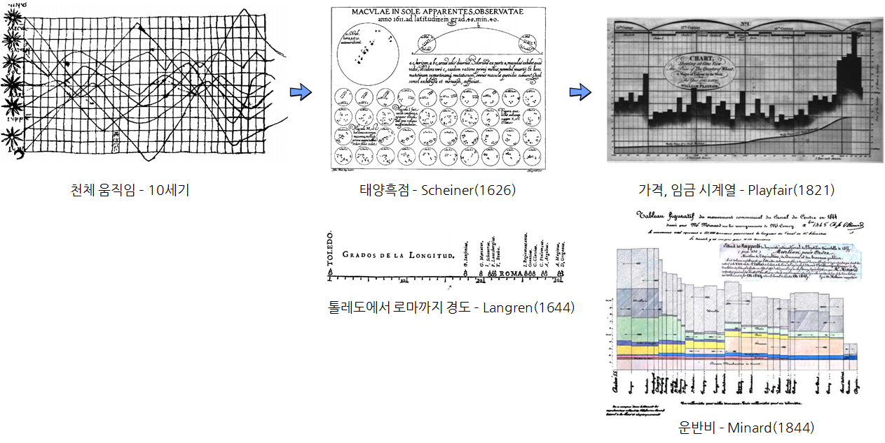

```{r  include = FALSE}
knitr::opts_chunk$set(echo = TRUE, warning=FALSE, message=FALSE,
                    comment="", digits = 3, tidy = FALSE, prompt = FALSE, fig.align = 'center')

library(ggplot2)
library(maps)
library(mapproj)
library(HistData) #  데이터
```


역사에 길이 남을 기념비적인 시각화 역작을 살펴보자. [^friendly-history] [^data-visualization-of-all-time] [^dataviz-timeline] 

[^friendly-history]: [Michael Friendly, "A Brief History of Data Visualization", In Handbook of Computational Statistics: Data Visualization, C. Chen, W. Härdle, A Unwin (Ed.), Heidelberg: Springer-Verlag, Ch. 1, pp. 1–34, 2007.](http://byrneslab.net/classes/data_science/readings/Friendly_2008_dataviz_history.pdf)

[^data-visualization-of-all-time]: [Tableau Software(2012), The 5 most influential data visualizations of all time](https://www.slideshare.net/TableauSoftware/the-5-most-influential-data-visualizations-of-all-time)

[^dataviz-timeline]: [DataVis.ca, "Milestones Project"](http://datavis.ca/milestones/)



# 나폴레옹 러시아 침공 {#march-on-moscow}

[나폴레옹 러시아 침공](https://en.wikipedia.org/wiki/French_invasion_of_Russia)을 [Charles Joseph Minard](https://en.wikipedia.org/wiki/Charles_Joseph_Minard)가
시각화한 산출물이 첫손에 꼽는 시각화 역작이다.


``` {r viz-minard}
library(ggplot2)
library(maps)
library(mapproj)
library(HistData) #  데이터
```

나폴레옹 군대 러시아 침공 데이터를 `HistData`에서 얻는다. 
위도경도 정보가 있기 때문에 이를 지도에 투영하여 시각화는데 공격(A)과 퇴각(R)을 색상으로 구분하고 
생존 군인수를 굵기를 통해 나폴레옹 군대의 러시아 침공 시점별로 군대 현황에 대한 정보를 한눈에 시각화할 수 있다.

``` {r viz-minard-data-map-ggplot}
# 1. 데이터 가져오기 -------------------------------------------------------------

data(Minard.troops); data(Minard.cities)
troops <- Minard.troops
cities <- Minard.cities

# 2. 지도 -------------------------------------------------------------
russia <- map_data("world", region="Russia")
russia <- subset(russia, group != 32)

# 3. 시각화 -----------------------------------------------------------
plot_polished <- ggplot(troops, aes(long, lat)) + 
    geom_path(aes(size=survivors, color = direction, group = group)) + 
    geom_text(aes(label = city), size = 3, data = cities) +
    coord_fixed(ratio=3) # 종횡비 조정: 3 x 1

plot_polished
```

# 존 스노우 콜레라 [^cholera-plot] [^snow-london] {#snow-cholera-map}

[^cholera-plot]: [R Package for Analyzing John Snow's 1854 Cholera Map](https://github.com/lindbrook/cholera)

[^snow-london]: [Kanchana Kovalam (March 29, 2017), "Kanchana Kovalam_512 90_Spring 2017_Remapping Snows Data"](https://rpubs.com/kanch/263664)


```{r dataviz-snow}
library(cholera)
par(mfrow=c(1,2))

plot(neighborhoodVoronoi())
plot(neighborhoodWalking())
```


# 갭마인더(Gapminder - Hans Rosling) [^gapminder-gganimate]   {#gapminder-rosling}

[^gapminder-gganimate]: [DataNovia, "GGANIMATE: HOW TO CREATE PLOTS WITH BEAUTIFUL ANIMATION IN R"](https://www.datanovia.com/en/blog/gganimate-how-to-create-plots-with-beautiful-animation-in-r/)

<iframe width="300" height="180" src="https://www.youtube.com/embed/jbkSRLYSojo" frameborder="0" allow="accelerometer; autoplay; encrypted-media; gyroscope; picture-in-picture" allowfullscreen></iframe>

```{r gapminder-dataviz}
library(gapminder)
library(gganimate)

ggplot(gapminder, aes(gdpPercap, lifeExp, size = pop, colour = country)) +
  geom_point(show.legend = FALSE, alpha = 0.7) +
  scale_color_viridis_d() +
  scale_size(range = c(2, 12)) +
  scale_x_log10() +
  labs(title = '연도: {frame_time}', x = '1인당 GDP', y = '기대수명') +
  transition_time(year) +
  ease_aes('linear')
```


# 나이팅게일 사망자수(War Mortality) [^nightingale-war-mortality] {#nightingale-war-mortality}

[^nightingale-war-mortality]: [Nguyen Chi Dung, "Florence Nightingale’s Data On Deaths From Various Causes In The Crimean War"](https://rpubs.com/chidungkt/371875)


```{r war-mortality}
library(HistData)
data(Nightingale)
library(tidyverse)
library(ggthemes)
library(extrafont)
loadfonts()

mortality_df <- Nightingale %>% 
  select(Date, Disease.rate, Wounds.rate, Other.rate) %>% 
  gather(Cause, Deaths, -Date) %>% 
  mutate(Cause = str_replace_all(Cause, "\\.rate", ""), 
         Regime = rep(c(rep("Before", 12), rep("After", 12)), 3)) %>% 
  mutate(Regime = factor(Regime, levels=c("Before", "After")))

cp <- coord_polar(start = 3*pi/2)
cp$is_free <- function() TRUE

mortality_df %>% 
  ggplot(aes(x = factor(Date), y = Deaths, fill = Cause)) +
  geom_col(color = "black") + 
  scale_y_sqrt() +
  # facet_wrap( ~ Regime, scales = "free", labeller = label_both) +
  facet_wrap( ~ Regime, scales = "free_x", labeller = label_both) + 
  cp +
  labs(x = NULL, y = NULL, 
       fill = "병사 사망원인",
       title = "크림전쟁 병사 사망원인 - 나이팅게일", 
       caption = "데이터 출처: 크림전쟁 병사 사망원인 데이터 종합") + 
  theme_fivethirtyeight(base_family = "NanumGothic") + 
  scale_fill_fivethirtyeight() +
  theme(legend.position = "top")

```


# 전기 도표(Chart of Biography) {#chart-biography}


# 마이애미 헤럴드 허리케인 피해 GIS 지도 [^miami-hurricane-map] {#hurricane-map}


[^miami-hurricane-map]: [RICHARD BEDFORD, Why a journalist should use GIS – Views from the leading experts](https://richybedford.wordpress.com/2014/01/10/why-journalists-sould-use-geographic-information-systems-gis-the-views-of-leading-data-journalism-experts/)
