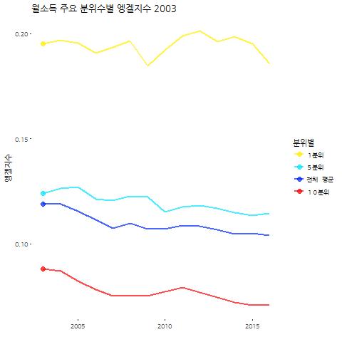

```{r  include = FALSE}
source("tools/chunk-options.R")
knitr::opts_chunk$set(echo = TRUE, warning=FALSE, message=FALSE, fig.width = 12, fig.height = 7)

library(tidyverse)
library(stringr)
library(rvest)
library(ggplot2)
library(ggthemes)
library(readxl)
library(ggmosaic) # devtools::install_github("haleyjeppson/ggmosaic")
library(NHANES) # install.packages("NHANES")
library(extrafont)
library(wesanderson)
library(gapminder)
library(FactoMineR)
loadfonts()

par(family = 'NanumGothic')
```

## 1. 분위별 가계 소득, 지출 현황 {#nso-balance-data}

소득분배 불평등에 대한 현황을 배율 혹은 백분율 기준으로 정보가 제공되고 있어 전문적으로 
훈련을 받지 않는 일반인 혹은 급하게 현황을 파악해야하는 입장에서는 쉽지 않다. [^household-inequality] [^chosun-inequality]

[^household-inequality]: [서울 소득 상위 20%, 하위 20% 보다 7배 더 벌어](http://news.hankyung.com/article/2017052557597)

[^chosun-inequality]: [2015 가계조사 - 하위 20% 소득 가장 많이 늘어…기초연금 강화 영향](http://biz.chosun.com/site/data/html_dir/2015/12/21/2015122101506.html)

[통계청 KOSIS - 소득10분위별 가구당 가계수지 (전국,2인이상)](http://kosis.kr/statHtml/statHtml.do?orgId=101&tblId=DT_1L9H008&conn_path=I3)를 통해 
소득 10분위별로 가구당 소득 및 지출에 대한 상세한 정보를 얻을 수 있다. 
엑셀이나 `.csv` 파일로 다운로드 받게 되면 빅데이터는 아니지만, 스몰데이터로 실제 엥겔지수 등 통계작업을 이어서 하거나, 시각화 작업이 그다지 녹록하지는 않다.

## 2. 주요 월소득 10 분위별 가계수지 항목별 분석 사전 준비 {#nso-setup}

통계청 소득 10 분위별 가구당 가계수지 데이터는 가구원수와 연령에 대한 정보와 함께 소득, 가계지출에 대한 금전적인 내용이 담겨있다.
데이터를 받아 분석이 가능한 형태로 만들고 반복되는 분석 시각화를 위해 시각화 함수를 별도로 작성한다.

``` {r household-setup}
# 0. 환경설정 -----------------------------------

# library(tidyverse)
# library(readxl)
# library(xts)
# library(stringr)

# 1. 데이터 가져오기 -----------------------------------
hh_dat <- read_excel("data/소득10분위별__가구당_가계수지__전국_2인이상__20170725133926.xlsx", sheet="데이터", skip=1)

names(hh_dat) <- c("월소득10분위별", "가계수지항목", "가구_03", "가구_04", "가구_05", "가구_06", "가구_07", "가구_08", 
                   "가구_09", "가구_10", "가구_11", "가구_12", "가구_13", "가구_14", "가구_15", "가구_16")

# 2. 데이터 정제 -----------------------------------
hh_df <- hh_dat %>% mutate(월소득10분위별 = zoo::na.locf(월소득10분위별, fromLast=FALSE)) %>% 
    mutate(월소득10분위별=factor(월소득10분위별, levels=c("１분위", "２분위", "３분위", "４분위", "５분위", "전체  평균",
                                              "６분위", "７분위", "８분위", "９분위", "１０분위")))
```


## 3. 주요 월소득 10 분위별 주요 지표 비교 {.tabset .tabset-fade .tabset-pills} {#major-index}

``` {r household-info-viz}
## 2.0. 시각화 함수 --------------------------------
decile_colors <- c("#ffee00", "#00e5ff", "#0026ff", "#ff0000")

draw_hh_graph <- function(var_name, var_rename) {
    
    graph_hh_df <- hh_df %>% filter(가계수지항목 == var_name) %>% 
        select(-가계수지항목) %>% 
        gather(연도, var_rename, -월소득10분위별) %>% 
        mutate(연도 = str_replace_all(연도, "가구_", "")) %>% 
        mutate(연도 = lubridate::ymd(paste0("20", 연도, "-01-01")))
    
    graph_hh_df %>% 
        dplyr::filter(월소득10분위별 %in% c("１분위", "５분위", "전체  평균", "１０분위")) %>% 
        ggplot(aes(x=연도, y=var_rename, color=월소득10분위별)) +
        theme_bw(base_family="NanumGothic") +
        labs(x="", y=var_name, title=paste0("주요 월소득10분위별 ", var_rename)) +
        geom_line(alpha=0.3, size=1.5) +
        geom_point(alpha=0.7, size=2.5) +
        scale_color_manual(values= decile_colors)
}
```

### 3.1. 가구원수(명) {#major-number-of-household}

``` {r household-number}
draw_hh_graph("가구원수 (명)", "가구원수")
```

### 3.2. 가구주 평균연령(세) {#major-household-age}

``` {r household-age}
draw_hh_graph("가구주연령 (세)", "가구주 연령")
```

### 3.3. 평균 소비성향(%) {#major-propenstiy-to-consume}

``` {r household-propensity}
draw_hh_graph("평균소비성향 (%)", "평균소비성향")
```

### 3.4. 가계 흑자율(%) {#major-surplus}

``` {r household-surplus}
draw_hh_graph("흑자율 (%)", "가계 흑자율")
```

## 4. 주요 월소득 10 분위별 가계소득, 소비지출 {.tabset .tabset-fade .tabset-pills} {#deciles-tab}

``` {r household-income-expenditure-viz}
draw_hh_money_graph <- function(var_name, var_rename) {
    
    graph_hh_df <- hh_df %>% filter(가계수지항목 == var_name) %>% 
        select(-가계수지항목) %>% 
        gather(연도, var_rename, -월소득10분위별) %>% 
        mutate(연도 = str_replace_all(연도, "가구_", "")) %>% 
        mutate(연도 = lubridate::ymd(paste0("20", 연도, "-01-01")))
    
    graph_hh_df %>% 
        dplyr::filter(월소득10분위별 %in% c("１분위", "５분위", "전체  평균", "１０분위")) %>% 
        ggplot(aes(x=연도, y=var_rename, color=월소득10분위별)) +
        theme_bw(base_family="NanumGothic") +
        labs(x="", y=var_name, title=paste0("주요 월소득10분위별 ", var_rename)) +
        geom_line(alpha=0.3, size=1.5) +
        geom_point(alpha=0.7, size=2.5) +
        scale_color_manual(values= decile_colors) +
        scale_y_continuous(labels = scales::comma)
}
```


### 4.1. 가구소득 {#deciles-income}

``` {r household-income}
draw_hh_money_graph("소득 (원)", "가구소득")
```

### 4.2. 가구 소비지출 {#deciles-expenditure}

``` {r household-expenditure}
draw_hh_money_graph("소비지출 (원)", "가구소비지출")
```

### 4.3. 교육비 지출 {#deciles-education}

``` {r household-edu}
draw_hh_money_graph("10.교육 (원)", "교육비 지출")
```

### 4.4. 보건의료지출 {#deciles-healthcare}

``` {r household-healthcare}
draw_hh_money_graph("06.보건 (원)", "보건의료지출")
```

## 5. 엥겔지수 {#engel-coefficient}

엥겔지수(Engel Coefficient)는 소득이 높아도 식비는 다른 지출에 비해 크게 오르지 않는다는 것을 전제로 한 개념으로, 
보통 $\frac{\text{식비}}{\text{총소득}}$ 이나 $\frac{\text{식비}}{\text{총지출비}}$ 등으로 표현하는데, 가장 많이 정의되는 $\frac{\text{식비}}{\text{총소득}}$을 바탕으로 분위별 엥겔지수를 환산하여 애니메이션으로 제작한다. [^engel-namu]

대한민국 1분위(하위20%)는 2010년, 2011년 나무위키 자료에 의하면 22% 대를 유지하고 있다.

[^engel-namu]: [나무위키 - 엥겔 계수](https://namu.wiki/w/%EC%97%A5%EA%B2%94%20%EA%B3%84%EC%88%98)

``` {r household-engel}
# 3. 엥겔지수 -----------------------------------

exp_hh_df <- hh_df %>% filter(가계수지항목 %in% c("가계지출 (원)")) %>% 
    select(-가계수지항목) %>% 
    gather(연도, 지출총액, -월소득10분위별)

food_hh_df <- hh_df %>% filter(가계수지항목 %in% c("01.식료품 · 비주류음료 (원)")) %>% 
    select(-가계수지항목) %>% 
    gather(연도, 식료품비, -월소득10분위별)

engel_hh_df <- inner_join(exp_hh_df, food_hh_df) %>% 
    mutate(엥겔지수 = 식료품비/지출총액) %>% 
    filter(월소득10분위별 %in% c("전체  평균", "１분위", "５분위", "１０분위")) %>% 
    mutate(연도 = str_replace_all(연도, "가구_", "")) %>% 
    mutate(연도 = lubridate::ymd(paste0("20", 연도, "-01-01")))

engel_hh_df <- engel_hh_df %>% 
    mutate(year = lubridate::year(연도))

engel_hh_df %>% select(-year) %>% 
    DT::datatable() %>% 
      DT::formatRound(c("지출총액", "식료품비"), digits=0) %>% 
      DT::formatRound(c("엥겔지수"), digits=2)

# 4. 시각화 -----------------------------------

decile_colors <- c("#ffee00", "#00e5ff", "#0026ff", "#ff0000")

engel_hh_gg <- ggplot(engel_hh_df, aes(x=연도, y=엥겔지수, color=월소득10분위별, cumulative = TRUE)) +
    geom_line(alpha=0.7, size=1) +
    geom_point(aes(x=연도, y=엥겔지수, frame=year), alpha=0.7, size=3) +
    theme_tufte(base_family="NanumGothic") + 
    labs(x="", y="엥겔지수", title="월소득 주요 분위수별 엥겔지수") +
    scale_color_manual(name="분위별", values=decile_colors)

# gganimate::gganimate(engel_hh_gg, "fig/engel_coefficient.gif")
```

 


## 6. 분위별 가계소득과 지출 흐름(Sankey) {.tabset .tabset-fade .tabset-pills} {#sankey}

주요 분위별 가계소득이 어떻게 들어오고, 소득을 어느 분야에 사용하는지와 함께 흑자와 적자에 대한 
내용을 생키도해(Sankey Diagram)을 통해 시각화한다. 이를 위해 `networkD3` 팩키지 
`sankeyNetwork()` 함수를 사용하고 분위별 가계소득, 소비지출 데이터를 적절한 형태로 가공한다.


``` {r household-sankey-data}
library(networkD3)

# 1. 데이터 가져오기 -----------------------------------
income_dat <- read_excel("data/소득10분위별__가구당_가계수지__전국_2인이상__20170725133926.xlsx", sheet="01_소득", col_names=TRUE)
expense_dat <- read_excel("data/소득10분위별__가구당_가계수지__전국_2인이상__20170725133926.xlsx", sheet="02_지출", col_names=TRUE)

hh_dat <- bind_rows(income_dat, expense_dat)

names(hh_dat) <- c("분위별", "from", "to",  "2003", "2004", "2005", "2006", "2007", "2008", "2009", "2010", "2011", "2012", "2013", "2014", "2015", "2016")


draw_sankey <- function(hh_year, hh_decile) {
    
    # 데이터 정제작업
    hh_flow <- hh_dat %>% filter(분위별==hh_decile) %>% 
        select(from, to, 소득지출 = hh_year) %>% 
        mutate(소득지출 = ifelse(from=="소득" & to=="가계지출", 소득지출/2, 소득지출))
    
    # 생키그림 -----------------------------------
    
    hh_node <- unique(c(hh_flow$from, hh_flow$to))
    hh_node_df <- data.frame(id=c(0:(length(hh_node)-1)), name=hh_node)
    
    lut <- c("소득" = 0, "경상소득" = 1,"근로소득" = 2,"사업소득" =3,"재산소득" =4,"이전소득" =5,"비경상소득"=6,"가계지출" =7,
             "소비지출"=8, "01.식료품·비주류음료"=9, "02.주류·담배"=10, "03.의류·신발"=11, "04.주거·수도·광열"=12, 
             "05.가정용품·가사서비스"=13, "06.보건"=14, "07.교통"=15, "08.통신"=16, "09.오락·문화"=17, "10.교육"=18, 
             "11.음식·숙박"=19, "12.기타상품·서비스"=20, "비소비지출"=21) 
    
    hh_flow$from <-  lut[hh_flow$from]
    hh_flow$to <-  lut[hh_flow$to]
    
    sankeyNetwork(Links = hh_flow, Nodes = hh_node_df, Source = 'from',
                  Target = 'to', Value = '소득지출', NodeID = 'name',
                  width = 700, fontSize = 12, nodeWidth = 30, fontFamily="NanumGothic")
}

```

### 가계 소득과 소비지출 흐름 - 2003 {#sankey-2003}

``` {r household-sankey-plot-2003}
# 2. 생키도해 시각화 -------
draw_sankey("2003", "１분위")
draw_sankey("2003", "전체평균")
draw_sankey("2003", "１０분위")
```

### 가계 소득과 소비지출 흐름 - 2016 {#sankey-2016}

``` {r household-sankey-plot-2016}
draw_sankey("2016", "１분위")
draw_sankey("2016", "전체평균")
draw_sankey("2016", "１０분위")
```


## 7. 가계 소득과 지출 와플 {#waffle}

[Make waffle (square pie) charts in R](https://github.com/hrbrmstr/waffle) 팩키지를 바탕으로 와플 파이(waffle pie) 그래프를 생성할 수 있다.

### 7.1. 가계소득 {#waffle-income}

가계소득을 대표 분위별로 뽑아서 와플 그래프로 시각화하는 것이 시각적으로 비교하기 좋은 경우가 있다.
가계소득의 원천을 각 분위별로 최하, 평균, 최상을 뽑아 와플 그래프로 시각화한다.


``` {r waffle-income}
# 0. 환경설정 ----------------------------
# install.packages("waffle")
library(waffle)

# 3. 소득 데이터----------------------------
## 3.1. 1 분위 소득 -------------------------------
hh_16_df <- hh_df %>% select(월소득10분위별,가계수지항목, 가구_16) %>% 
  filter(str_detect(월소득10분위별, "１분위")) %>% 
  filter(str_detect(가계수지항목, "소득")) %>% 
  filter(!str_detect(가계수지항목, "처분가능소득")) %>% 
  mutate(가계수지항목 = str_replace_all(가계수지항목, "\\s|\\(원\\)", "")) %>% 
  filter(!가계수지항목 %in% c("소득", "경상소득")) %>% 
  mutate(가구_16 = 가구_16/10^4)

hh_items_v <- hh_16_df %>% 
  select(가계수지항목) %>% unlist
hh_value_v <- hh_16_df %>% 
  select(가구_16) %>% unlist  

names(hh_value_v) <- hh_items_v

hh_income_1 <- waffle(hh_value_v * 5, rows=10, legend_pos = "right", xlab="정사각형 1개 = 0.2만원",
                      title="1분위 가구당 가계수지 - 소득 (2016)")

## 3.2. 평균 소득 -------------------------------
hh_16_df <- hh_df %>% select(월소득10분위별,가계수지항목, 가구_16) %>% 
  filter(str_detect(월소득10분위별, "전체  평균")) %>% 
  filter(str_detect(가계수지항목, "소득")) %>% 
  filter(!str_detect(가계수지항목, "처분가능소득")) %>% 
  mutate(가계수지항목 = str_replace_all(가계수지항목, "\\s|\\(원\\)", "")) %>% 
  filter(!가계수지항목 %in% c("소득", "경상소득")) %>% 
  mutate(가구_16 = 가구_16/10^4)

hh_items_v <- hh_16_df %>% 
  select(가계수지항목) %>% unlist
hh_value_v <- hh_16_df %>% 
  select(가구_16) %>% unlist  

names(hh_value_v) <- hh_items_v

hh_income_mean <- waffle(hh_value_v, rows=10, legend_pos = "right", xlab="정사각형 1개 = 1만원",
  title="평균 가구당 가계수지 - 소득 (2016)")

## 3.3. 10 분위 소득 -------------------------------

hh_16_df <- hh_df %>% select(월소득10분위별,가계수지항목, 가구_16) %>% 
  filter(str_detect(월소득10분위별, "１０분위")) %>% 
  filter(str_detect(가계수지항목, "소득")) %>% 
  filter(!str_detect(가계수지항목, "처분가능소득")) %>% 
  mutate(가계수지항목 = str_replace_all(가계수지항목, "\\s|\\(원\\)", "")) %>% 
  filter(!가계수지항목 %in% c("소득", "경상소득")) %>% 
  mutate(가구_16 = 가구_16/10^4)

hh_items_v <- hh_16_df %>% 
  select(가계수지항목) %>% unlist
hh_value_v <- hh_16_df %>% 
  select(가구_16) %>% unlist  

names(hh_value_v) <- hh_items_v

hh_income_10 <- waffle(hh_value_v/2, rows=10, legend_pos = "right", xlab="정사각형 1개 = 2만원",
         title="10분위 가구당 가계수지 - 소득 (2016)")

## 3.4. 결합
iron(hh_income_1, hh_income_mean, hh_income_10)
```

### 7.2. 가계지출 {#waffle-expenditure}

가계지출을 대표 분위별로 뽑아서 가장 영향력 높은 13개 항목 중 지출비중이 높은 8개를 추린다.
가계지출의 원천을 각 분위별로 최하, 평균, 최상을 뽑아 와플 그래프로 시각화한다.

``` {r waffle-expenditure}
# 4. 지출 데이터----------------------------
## 4.1. 1 분위 소득 -------------------------------
hh_exp_16_df <- hh_df %>% select(월소득10분위별,가계수지항목, 가구_16) %>% 
  filter(str_detect(월소득10분위별, "１분위")) %>% 
  filter(str_detect(가계수지항목, "^[0-9]|비소비지출")) %>% 
  filter(!str_detect(가계수지항목, "11.음식|12.기타상품|03.의류|05.가정용품|07.교통")) %>% 
  mutate(가계수지항목 = str_replace_all(가계수지항목, "\\s|\\(원\\)", "")) %>% 
  mutate(가구_16 = 가구_16/10^4)

hh_exp_items_v <- hh_exp_16_df %>% 
  select(가계수지항목) %>% unlist
hh_exp_value_v <- hh_exp_16_df %>% 
  select(가구_16) %>% unlist  

names(hh_exp_value_v) <- hh_exp_items_v

hh_exp_1 <- waffle(hh_exp_value_v * 2, rows=10, legend_pos = "right", xlab="정사각형 1개 = 0.5만원",
                      title="1분위 가계 - 지출 (2016)")

## 4.2. 평균 지출 -------------------------------
hh_exp_16_df <- hh_df %>% select(월소득10분위별,가계수지항목, 가구_16) %>% 
  filter(str_detect(월소득10분위별, "전체  평균")) %>% 
  filter(str_detect(가계수지항목, "^[0-9]|비소비지출")) %>% 
  filter(!str_detect(가계수지항목, "11.음식|12.기타상품|03.의류|05.가정용품|07.교통")) %>% 
  mutate(가계수지항목 = str_replace_all(가계수지항목, "\\s|\\(원\\)", "")) %>% 
  mutate(가구_16 = 가구_16/10^4)

hh_exp_items_v <- hh_exp_16_df %>% 
  select(가계수지항목) %>% unlist
hh_exp_value_v <- hh_exp_16_df %>% 
  select(가구_16) %>% unlist  

names(hh_exp_value_v) <- hh_exp_items_v

hh_exp_mean <- waffle(hh_exp_value_v, rows=10, legend_pos = "right", xlab="정사각형 1개 = 1만원",
       title="평균 가계 - 지출 (2016)")

## 4.3. 1 분위 지출 -------------------------------
hh_exp_16_df <- hh_df %>% select(월소득10분위별,가계수지항목, 가구_16) %>% 
  filter(str_detect(월소득10분위별, "１０분위")) %>% 
  filter(str_detect(가계수지항목, "^[0-9]|비소비지출")) %>% 
  filter(!str_detect(가계수지항목, "11.음식|12.기타상품|03.의류|05.가정용품|07.교통")) %>% 
  mutate(가계수지항목 = str_replace_all(가계수지항목, "\\s|\\(원\\)", "")) %>% 
  mutate(가구_16 = 가구_16/10^4)

hh_exp_items_v <- hh_exp_16_df %>% 
  select(가계수지항목) %>% unlist
hh_exp_value_v <- hh_exp_16_df %>% 
  select(가구_16) %>% unlist  

names(hh_exp_value_v) <- hh_exp_items_v

hh_exp_10 <- waffle(hh_exp_value_v/2, rows=10, legend_pos = "right", xlab="정사각형 1개 = 2만원",
       title="10분위 가계 - 지출 (2016)")

## 4.4. 결합
iron(hh_exp_1, hh_exp_mean, hh_exp_10)
```
