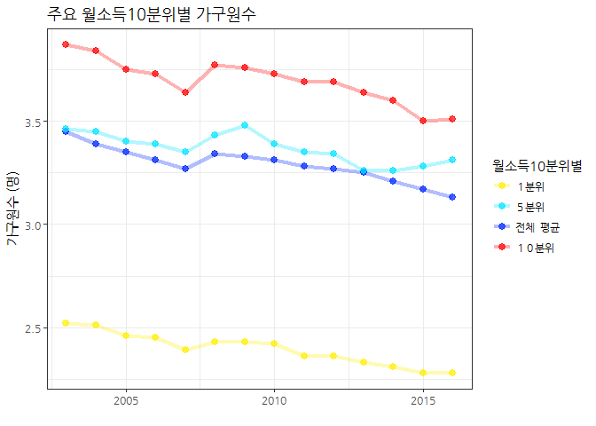
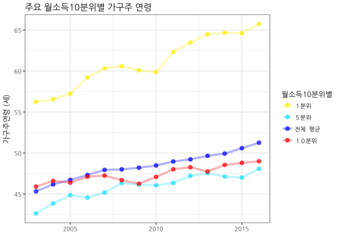
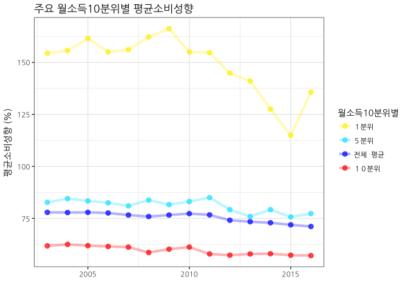
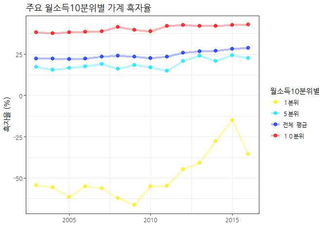
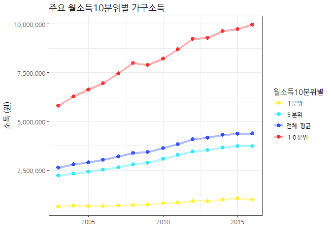
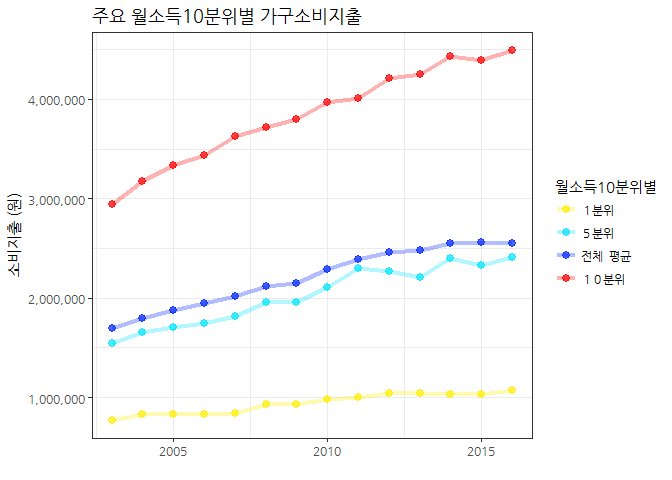
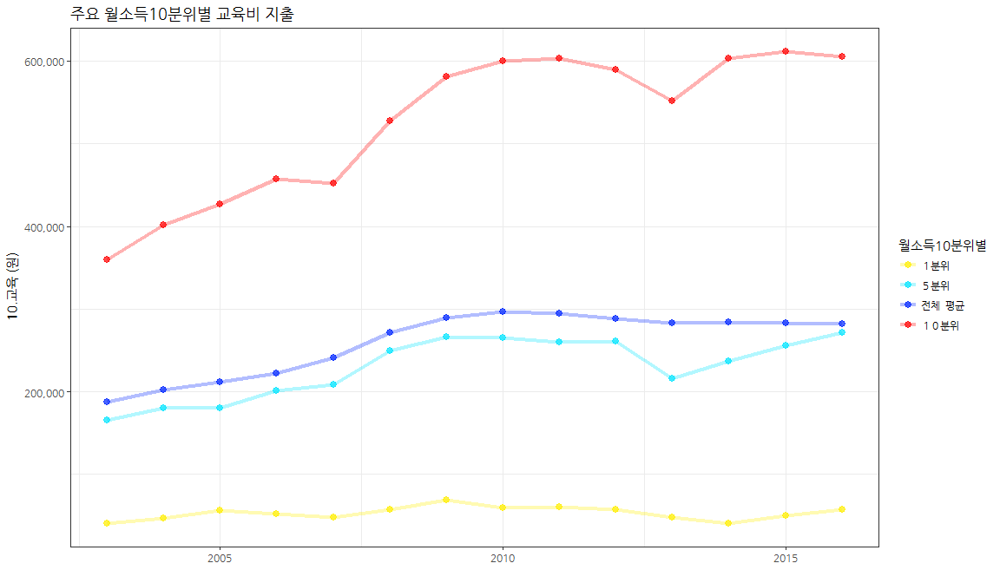
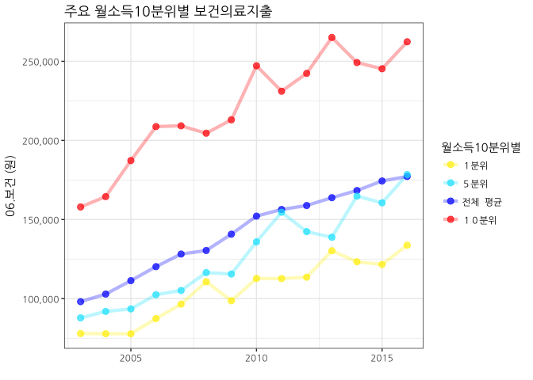

# 데이터 과학

## 1. 분위별 가계 소득, 지출 현황

소득분배 불평등에 대한 현황을 배율 혹은 백분율 기준으로 정보가 제공되고 있어 전문적으로 
훈련을 받지 않는 일반인 혹은 급하게 현황을 파악해야하는 입장에서는 쉽지 않다. [^household-inequality] [^chosun-inequality]

[^household-inequality]: [서울 소득 상위 20%, 하위 20% 보다 7배 더 벌어](http://news.hankyung.com/article/2017052557597)

[^chosun-inequality]: [2015 가계조사 - 하위 20% 소득 가장 많이 늘어…기초연금 강화 영향](http://biz.chosun.com/site/data/html_dir/2015/12/21/2015122101506.html)

[통계청 KOSIS - 소득10분위별 가구당 가계수지 (전국,2인이상)](http://kosis.kr/statHtml/statHtml.do?orgId=101&tblId=DT_1L9H008&conn_path=I3)를 통해 
소득 10분위별로 가구당 소득 및 지출에 대한 상세한 정보를 얻을 수 있다. 
엑셀이나 `.csv` 파일로 다운로드 받게 되면 빅데이터는 아니지만, 스몰데이터로 실제 엥겔지수 등 통계작업을 이어서 하거나, 시각화 작업이 그다지 녹록하지는 않다.

## 2. 주요 월소득 10 분위별 가계수지 항목별 분석 사전 준비

통계청 소득 10 분위별 가구당 가계수지 데이터는 가구원수와 연령에 대한 정보와 함께 소득, 가계지출에 대한 금전적인 내용이 담겨있다.
데이터를 받아 분석이 가능한 형태로 만들고 반복되는 분석 시각화를 위해 시각화 함수를 별도로 작성한다.

~~~{.r}
# 0. 환경설정 -----------------------------------

# library(tidyverse)
# library(readxl)
# library(xts)
# library(stringr)

# 1. 데이터 가져오기 -----------------------------------
hh_dat <- read_excel("data/소득10분위별__가구당_가계수지__전국_2인이상__20170725133926.xlsx", sheet="데이터", skip=1)

names(hh_dat) <- c("월소득10분위별", "가계수지항목", "가구_03", "가구_04", "가구_05", "가구_06", "가구_07", "가구_08", 
                   "가구_09", "가구_10", "가구_11", "가구_12", "가구_13", "가구_14", "가구_15", "가구_16")

# 2. 데이터 정제 -----------------------------------
hh_df <- hh_dat %>% mutate(월소득10분위별 = zoo::na.locf(월소득10분위별, fromLast=FALSE)) %>% 
    mutate(월소득10분위별=factor(월소득10분위별, levels=c("１분위", "２분위", "３분위", "４분위", "５분위", "전체  평균",
                                              "６분위", "７분위", "８분위", "９분위", "１０분위")))
~~~

## 3. 주요 월소득 10 분위별 주요 지표 비교 {.tabset .tabset-fade .tabset-pills}

~~~{.r}
## 2.0. 시각화 함수 --------------------------------
decile_colors <- c("#ffee00", "#00e5ff", "#0026ff", "#ff0000")

draw_hh_graph <- function(var_name, var_rename) {
    
    graph_hh_df <- hh_df %>% filter(가계수지항목 == var_name) %>% 
        select(-가계수지항목) %>% 
        gather(연도, var_rename, -월소득10분위별) %>% 
        mutate(연도 = str_replace_all(연도, "가구_", "")) %>% 
        mutate(연도 = lubridate::ymd(paste0("20", 연도, "-01-01")))
    
    graph_hh_df %>% 
        dplyr::filter(월소득10분위별 %in% c("１분위", "５분위", "전체  평균", "１０분위")) %>% 
        ggplot(aes(x=연도, y=var_rename, color=월소득10분위별)) +
        theme_bw(base_family="NanumGothic") +
        labs(x="", y=var_name, title=paste0("주요 월소득10분위별 ", var_rename)) +
        geom_line(alpha=0.3, size=1.5) +
        geom_point(alpha=0.7, size=2.5) +
        scale_color_manual(values= decile_colors)
}
~~~

### 3.1. 가구원수(명)

~~~{.r}
draw_hh_graph("가구원수 (명)", "가구원수")
~~~

### 3.2. 가구주 평균연령(세) 

~~~{.r}
draw_hh_graph("가구주연령 (세)", "가구주 연령")
~~~

### 3.3. 평균 소비성향(%)

~~~{.r}
draw_hh_graph("평균소비성향 (%)", "평균소비성향")
~~~

### 3.4. 가계 흑자율(%)

~~~{.r}
draw_hh_graph("흑자율 (%)", "가계 흑자율")
~~~

## 4. 주요 월소득 10 분위별 가계소득, 소비지출 {.tabset .tabset-fade .tabset-pills}

~~~{.r}
draw_hh_money_graph <- function(var_name, var_rename) {
    
    graph_hh_df <- hh_df %>% filter(가계수지항목 == var_name) %>% 
        select(-가계수지항목) %>% 
        gather(연도, var_rename, -월소득10분위별) %>% 
        mutate(연도 = str_replace_all(연도, "가구_", "")) %>% 
        mutate(연도 = lubridate::ymd(paste0("20", 연도, "-01-01")))
    
    graph_hh_df %>% 
        dplyr::filter(월소득10분위별 %in% c("１분위", "５분위", "전체  평균", "１０분위")) %>% 
        ggplot(aes(x=연도, y=var_rename, color=월소득10분위별)) +
        theme_bw(base_family="NanumGothic") +
        labs(x="", y=var_name, title=paste0("주요 월소득10분위별 ", var_rename)) +
        geom_line(alpha=0.3, size=1.5) +
        geom_point(alpha=0.7, size=2.5) +
        scale_color_manual(values= decile_colors) +
        scale_y_continuous(labels = scales::comma)
}
~~~

### 4.1. 가구소득

~~~{.r}
draw_hh_money_graph("소득 (원)", "가구소득")
~~~

### 4.2. 가구 소비지출

~~~{.r}
draw_hh_money_graph("소비지출 (원)", "가구소비지출")
~~~

### 4.3. 교육비 지출

~~~{.r}
draw_hh_money_graph("10.교육 (원)", "교육비 지출")
~~~

### 4.4. 보건의료지출

~~~{.r}
draw_hh_money_graph("06.보건 (원)", "보건의료지출")
~~~

