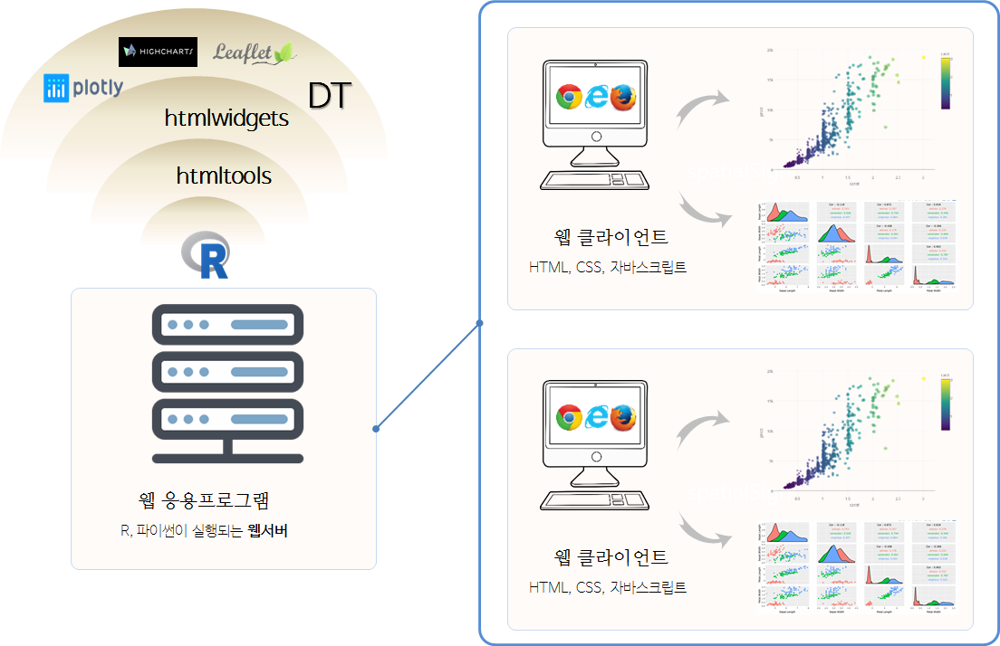

```{r  include = FALSE}
source("tools/chunk-options.R")

knitr::opts_chunk$set(echo = TRUE, warning=FALSE, message=FALSE,
                    comment="", digits = 3, tidy = FALSE, prompt = TRUE, fig.align = 'center')


````


# R과 `plotly` 인터랙티브 시각화 [^carson-sievert-useR18] [^plotly-book] {#plotly-carson-book}

[^carson-sievert-useR18]: [Carson Sievert(2018), "Interactive dataviz on the web with R & plotly"](https://tutorials.cpsievert.me/20180711/#1)

[^plotly-book]: [Carson Sievert, "plotly for R"](https://plotly-book.cpsievert.me/index.html)

웹기술(Web technology)은 데이터과학 작업흐름에서 의사소통(Communication)에 큰 장점이 있지만, 데이터 탐색과 이해(Explore and Understand)를 위해서 
적합하지는 않다. 하지만, 인터랙티브 기능을 넣어 데이터 탐색과 이해를 강화시킬 수 있는 측면이 있는 것도 사실이다.

- 인터랙티브 기능을 활용하여 미처 놓친 구조를 식별할 수 있다: [Tukey 1972](http://stat-graphics.org/movies/prim9.html)
- 전체적으로 명세된 질문 없이도 신속히 정보를 찾을 수 있고 다수 연결된 뷰는 데이터에 대한 쿼리를 제시하는데 최적틀이 된다.[Buja, Cook, & Swayne 1996](https://www.jstor.org/stable/1390754?seq=1), [Unwin & Hofmann, 2000](https://www.researchgate.net/publication/2425912_GUI_and_Command-line_-_Conflict_or_Synergy)
- 모형을 이해하고 진단하고 비교하는데 사용: [Wickham, Cook, & Hofmann 2015).]()


학계에서 바라보는 인터랙티브 그래픽은 실무에서 신속히 반복(iteration)을 돌릴 경우 탐색적 데이터 분석에 도움이 될 수 있고,
쉽게 배포가 가능할 때만 발표(presentation)기능을 향상시킬 수 있다.

# 인터랙티브 그래픽 아키텍처 {#plotly-architecture}


