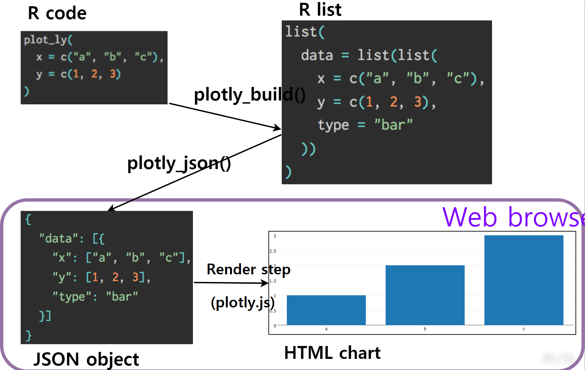

```{r  include = FALSE}
source("tools/chunk-options.R")

knitr::opts_chunk$set(echo = TRUE, warning=FALSE, message=FALSE,
                    comment="", digits = 3, tidy = FALSE, prompt = TRUE, fig.align = 'center')


````


# R과 `plotly` 인터랙티브 시각화 [^carson-sievert-useR18] [^plotly-book] {#plotly-carson-book}

[^carson-sievert-useR18]: [Carson Sievert(2018), "Interactive dataviz on the web with R & plotly"](https://tutorials.cpsievert.me/20180711/#1)

[^plotly-book]: [Carson Sievert, "plotly for R"](https://plotly-book.cpsievert.me/index.html)

웹기술(Web technology)은 데이터과학 작업흐름에서 의사소통(Communication)에 큰 장점이 있지만, 데이터 탐색과 이해(Explore and Understand)를 위해서 
적합하지는 않다. 하지만, 인터랙티브 기능을 넣어 데이터 탐색과 이해를 강화시킬 수 있는 측면이 있는 것도 사실이다.

- 인터랙티브 기능을 활용하여 미처 놓친 구조를 식별할 수 있다: [Tukey 1972](http://stat-graphics.org/movies/prim9.html)
- 전체적으로 명세된 질문 없이도 신속히 정보를 찾을 수 있고 다수 연결된 뷰는 데이터에 대한 쿼리를 제시하는데 최적틀이 된다.[Buja, Cook, & Swayne 1996](https://www.jstor.org/stable/1390754?seq=1), [Unwin & Hofmann, 2000](https://www.researchgate.net/publication/2425912_GUI_and_Command-line_-_Conflict_or_Synergy)
- 모형을 이해하고 진단하고 비교하는데 사용: [Wickham, Cook, & Hofmann 2015).]()


학계에서 바라보는 인터랙티브 그래픽은 실무에서 신속히 반복(iteration)을 돌릴 경우 탐색적 데이터 분석에 도움이 될 수 있고,
쉽게 배포가 가능할 때만 발표(presentation)기능을 향상시킬 수 있다.

# 인터랙티브 그래픽 아키텍처 {#plotly-architecture}

R 언어로 웹기술을 활용하는 방식은 HTML을 생성하는 [`htmltools`](https://github.com/rstudio/htmltools)를 기반으로 
자바스크립트 라이브러리에 R을 결합시키는 [`htmlwidgets`](https://github.com/ramnathv/htmlwidgets) 팩키지를 통해 다양한 
기능의 강력한 자바스크립트 라이브러리를 R에서 사용할 수 있게 된다.

[htmlwidgets for R](http://www.htmlwidgets.org/showcase_datatables.html) 사이트에서 R에서 불러 바로 사용할 수 있는 
htmlwidgets을 볼 수 있다.

- Leaflet
- dygraphs
- plotly
- rbokeh
- visNetwork
- networkD3
- DataTables
- threejs
- DiagrammeR


# `plotly` 내부 메커니즘 {#plotly-inside-mechanism}

웹기술을 활용하여 인터랙티브 그래프를 생성하기 위해서 일단 R 코드를 작성한다.
그리고 나서 `plotly_build()` 함수를 생성해서 R 리스트로 자료구조를 변경시키고,
이를 `plotly_json()` 함수로 JSON 객체를 만들고 마지막에 `plotly.js`를 사용하여 HTML 그래프를 생성시킨다.
최종 HTML 그래프를 웹브라우저에서 볼 수 있게 된다.




# `gapminder` 사례 {#gampinder-interactive-showcase}

`gapminer` 데이터를 바탕으로 인터랙티브 그래프 시각화 사항을 구현해보자.

## 정적 그래프 {#gampinder-interactive-showcase-static}

인터랙티브 그래프를 작성할 때 가장 먼저 해야할 작업은 `tidy` 데이터를 `ggplot`에 넣어 인터랙티브 그래프의 
기능을 사전에 점검하는 것이 된다. 이를 위해서 사전에 `ggplot`으로 잘 정리된 `gapminder` 데이터를 가져와서 
각 국가별로 연도별 기대수명을 시각화한다. 

``` {r gapminder-interactive-showcase}
# 0. 환경설정 -----
library(tidyverse)
library(plotly)
library(gapminder)
library(glue)
library(crosstalk)
library(leaflet)

# 1. 정적 그래프 -----

gapminder %>% 
    ggplot(aes(x=year, y=lifeExp, group=country)) + 
      geom_line()
```


## 인터랙티브 그래프 {#gampinder-interactive-showcase-interactive}

인터랙티브 그래프를 생성시키는 방법은 `plotly`, `dygraphs`, `highchart` 팩키지를 직접 활용하는 방식도 있지만,
`ggplotly()` 함수로 이미 개발된 정적 그래프를 인터랙티브하게 변환시키는 방식이 간편하면서 유용할 때가 많다.


``` {r gapminder-interactive-showcase-plotly}
# 2. 정적 그래프 인터랙티브 변환 -----
p <- gapminder %>% 
    ggplot(aes(x=year, y=lifeExp, group=country)) + 
      geom_line()

ggplotly(p)
```

## 툴팁(tooltip) 기능 {#gampinder-interactive-showcase-interactive-tooltip}

인터랙티브 그래프를 작성하게 되면 다음으로 클릭했을 때 바로 정보를 보여줄 수 있도록 
**툴팁(tooltip)** 기능이 많이 사용된다. `ggplot`에 `text`가 그 역할을 수행한다.
`ggplotly()` 함수에 `tooltip = "text"` 인자를 전달하면 간단히 기능을 구현할 수 있다. 

``` {r gapminder-interactive-showcase-tooltip}
# 3. 툴팁 기능 -----
p <- gapminder %>% 
    ggplot(aes(x=year, y=lifeExp, group=country, text=paste0("대륙: ", continent, "\n", 
                                                             "국가: ", country))) + 
    geom_line()

ggplotly(p, tooltip = "text")
```

## 강조(highlight) 기능 {#gampinder-interactive-showcase-interactive-highlight}

툴팁과 함께 **강조(highlight)** 기능도 빼놓을 수 없는 중요하다.
이를 위해서 우선 `highlight_key()` 함수로 강조할 객체를 별도로 빼놓고 이를 
`ggplotly()` 함수로 plotly 객체로 변환시킨 후에 `hightlight()` 함수로 매개변수를 넣어 기능을 구현하면 된다.

``` {r gapminder-interactive-showcase-highlight}
# 4. 하이라이트 기능 -----
gapminder_highlight <- highlight_key(gapminder, ~country)

life_g <- gapminder_highlight %>% 
    ggplot(aes(x=year, y=lifeExp, group=country, text=paste0("대륙: ", continent, "\n", 
                                                             "국가: ", country))) + 
    geom_line()

life_gg <- ggplotly(life_g, tooltip = "text")
highlight(life_gg, on = "plotly_click", selectize = TRUE, dynamic = TRUE, persistent = TRUE)
```

## 연결된 뷰(linked View) 기능 {#gampinder-interactive-showcase-interactive-linked-view}

인터랙티브 그래프를 개발할 때 빼놓을 수 없는 기능이 **연결된 뷰(linked View) 기능**이다.
이런 목적으로 개발된 것이 `crosstalk` 팩키지다. 측면보기 `faceting` 기능으로 잘 알려진
`Small Multiple`로 구현하거나 다수 그래프가 데이터에 대한 다른 정보를 제공하는데 
각 데이터가 유기적으로 연결된 모습을 보여줄 경우 더 많은 인사이트를 빠르고 얻는데 도움이 된다.

``` {r gapminder-interactive-showcase-linked-view}
# 5. Small Multiple 기능 -----
gapminder_cjk <- gapminder %>% 
    filter(country %in% c("China", "Japan", "Korea, Rep."))

gapminder_sd <- SharedData$new(gapminder_cjk, ~country)

life_g <- gapminder_sd %>% 
    ggplot(aes(x=year, y=lifeExp, group=country, text=paste0("대륙: ", continent, "\n", 
                                                             "국가: ", country))) + 
    geom_line() +
    geom_point() +
    facet_wrap(~country)

ggplotly(life_g, tooltip = "text")
```

## `ggpairs` 사례 {#gampinder-interactive-showcase-interactive-ggpairs}

`ggpairs()` 함수는 두변량간의 관계를 시각적으로 일별할 수 있는 유용한 함수다.
두변량간의 관계를 정적그래프가 아닌 인터랙티브 기능을 넣어 보는 것도 시각적으로 도전해볼만한 과제다.


`shiny` 서버가 있는 경우 당연히 구현이 가능하지만 서버없이 클라이언트에서만 
인터랙티브 그래프를 작성하게 되는 경우 `crosstalk`를 사용하게 되는데 서로 다른 
기능을 수행하는 그래프가 연결된 경우, 경우에 따라서 연결된 뷰의 업데이트 기능에 한계가 있을 수 있다.

``` {r gapminder-interactive-showcase-ggpairs}
## 5.1. linked view 기능 -----
iris_sd <- SharedData$new(iris)
iris_g <- GGally::ggpairs(iris_sd, aes(color = Species), columns = 1:4)
highlight(ggplotly(iris_g), on = "plotly_selected")
```


## 애니메이션 기능 {#gampinder-interactive-showcase-interactive-animation}

시간정보가 포함된 데이터를 갖는 경우 애니메이션 기능도 넣는 것도 가능하다.
이를 위해서 `frame=` 매개변수를 넣어 시각화하면 간단히 인터랙티브 그래프에 애니메이션으로 확장이 가능하다.

``` {r gapminder-interactive-showcase-animation}
# 6. 애니메이션 기능 -----
life_g <- gapminder %>% 
    ggplot(aes(x=gdpPercap, y=lifeExp, group=country, color=country,
               text=paste0("대륙: ", continent, "\n", 
                           "국가: ", country))) + 
        geom_point(alpha = 0.2) +
        geom_point(aes(frame = year), color="red") +
        facet_wrap(~continent, ncol = 2) +
        scale_x_sqrt() +
        theme(legend.position = "none")

ggplotly(life_g, tooltip="text")
```


## 다른 위젯 조합 {#gampinder-interactive-showcase-interactive-widgets}

기존 그래프 문법을 사용한 `ggplot` 뿐만 아니라 앞서 다양한 자바스크립트 라이브러리를 `htmlwidgets`을 통해 
구현이 되어 있어 지리정보, 시계열 데이터, 네트워크 등 htmlwidgets와 결합하여 사용하는 것도 가능하다.


``` {r gapminder-interactive-showcase-widgets}
# 8. 다른 htmlwidgets 과 만남 -----
options(persistent = TRUE)

sd <- SharedData$new(quakes)

p <- plot_ly(sd, x = ~depth, y = ~mag) %>% 
    add_markers(alpha = 0.5) %>%
    highlight("plotly_selected", dynamic = TRUE)

map <- leaflet(sd) %>% 
    addTiles() %>% 
    addCircles()

bscols(widths = c(6, 6), p, map)
```

## 데이터 분석 심화 {#gampinder-interactive-showcase-interactive-data-analysis}

### `ggplot` 사례 {#gampinder-interactive-showcase-interactive-data-analysis-ggplot}

`ggplot`으로 산점도, 히스토그램, 상자그림 등을 `crosstalk`로 연결시켜 놓고 `subplot()` 함수로 
결합해서 연결된 뷰를 활용하여 심화 데이터 분석 작업을 수행한다.

``` {r gapminder-interactive-showcase-widgets-data-analysis}
# 9. ggplot 데이터 분석 -----
m <- SharedData$new(mpg)

p1 <- ggplot(m, aes(displ, fill = class)) + 
    geom_density()
p2 <- ggplot(m, aes(displ, hwy, fill = class)) + 
    geom_point()

subplot(p1, p2) %>% highlight("plotly_click") %>% hide_legend()
```


### `plotly` 사례 {#gampinder-interactive-showcase-interactive-data-analysis-plotly}

`ggplot`으로 `plotly`객체로 변환하는 것도 좋은 전략이 되지만, 인터랙티브 그래픽에 특화된 
`plot_ly()` 등 다양한 `plotly` 팩키지 함수를 사용하여 조합하는 것도 가능하다. 

``` {r gapminder-interactive-showcase-widgets-data-analysis2}
# 9. plotly 데이터 분석 -----

d <- highlight_key(mtcars)
sp_g <- ggplot(d, aes(x = mpg, y = disp)) +
    geom_point()
sp_gg <- ggplotly(sp_g)

hist <- plot_ly(d, x = ~factor(cyl)) %>% add_histogram(color = I("black"))
box <- plot_ly(d, y = ~disp, color = I("black")) %>% add_boxplot(name = " ")
violin <- plot_ly(d, y = ~disp, color = I("black")) %>% add_trace(type = "violin", name = " ")

subplot(sp_gg, box, violin, shareY = TRUE, titleX = TRUE, titleY = TRUE) %>%
    subplot(hist, widths = c(.75, .25), titleX = TRUE, titleY = TRUE) %>%
    layout(
        barmode = "overlay", 
        title = "Click and drag scatterplot",
        showlegend = FALSE
    ) %>%
    highlight("plotly_selected")
```

