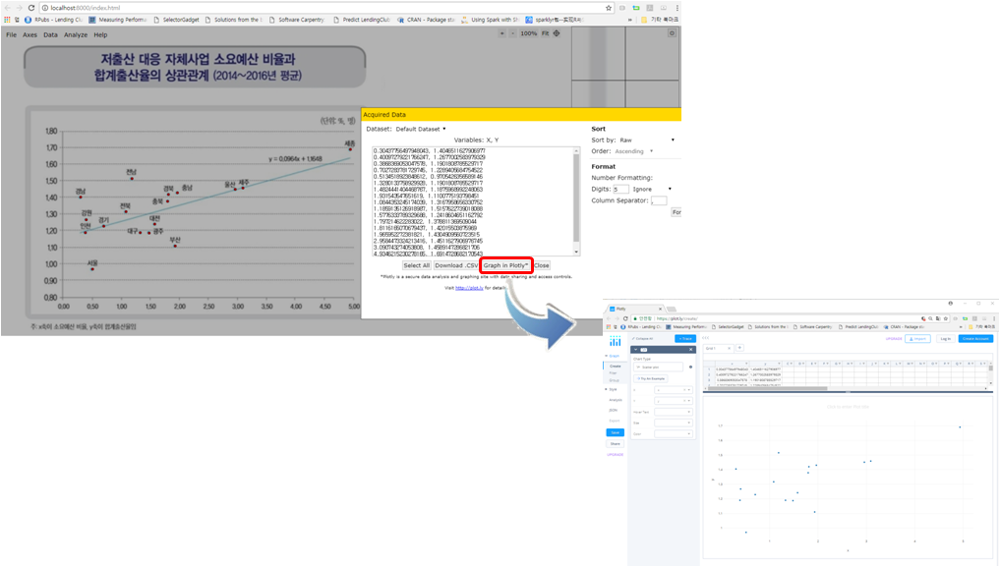

```{r  include = FALSE}
source("tools/chunk-options.R")
knitr::opts_chunk$set(echo = TRUE, warning=FALSE, message=FALSE, fig.width = 12, fig.height = 7)

library(tidyverse)
library(digitizeR)
library(extrafont)
library(hrbrthemes)
loadfonts()

par(family = 'NanumGothic')
```

## 1. 지방자치단체별 저출산 지표 및 시사점 [^assembly-report] {#assembly-report}

[^assembly-report]: [박선권(2017), "지표로 보는 이슈 - 지방자치단체별 저출산 지표 및 시사점", 국회입법조사처](https://www.nars.go.kr/brdView.do?brd_Seq=21265&cmsCd=CM0150)

국회 입법조사처에서 "지방자치단체별 저출산 지표 및 시사점" 제목의 보고서를 발간하였다.
이를 바탕으로 다수 언론사에서 이를 바탕으로 기사를 다수 제작하여 보도했다.

- SBS 뉴스: [지자체 저출산 예산 많이 쓸수록 출산율 높다](http://news.sbs.co.kr/news/endPage.do?news_id=N1004331601&plink=COPYPASTE&cooper=SBSNEWSEND)
- 경향비즈: [지자체 저출산 대책에도 ‘공짜점심’은 없다](http://biz.khan.co.kr/khan_art_view.html?artid=201708041637001&code=920100#csidx61255abfdcd710d8f85afeb3c18b8d8)
- 연합뉴스: [지자체 저출산 예산 많이 쓸수록 출산율 높다](http://www.yonhapnews.co.kr/bulletin/2017/08/04/0200000000AKR20170804125700017.HTML)
- 그외 다수

국회입법조사처에서는 2014~2016년 지방자치단체별 저출산 대응 자체사업 소요예산 비율과 합계출산율이 양(＋)의 상관관계(r=0.6637)가 있는 것으로 나타났기 때문에,
저출산문제를 해결해나가는 방법으로 "저출산 대응 자체사업 소요예산"을 증가하는데 각 지자체별로 효과를 극대화하는데 조달된 예산을 효율적인 사용을 강조하고 있다.

## 2. 저출산 대응 자체사업 소요예산 비율과 합계출산율이 양(＋)의 상관관계인가? {#report-correlation}

2014~2016년 지방자치단체별 저출산 대응 자체사업 소요예산 비율 데이터와 합계출산율 데이터를 시도별로 취합하여 이를 바탕으로 양의 상관관계가 나왔다는 사실에 기초해서
정부정책 방향과 각 지자체 추진 정책에 대한 방향을 제시하고 있다.


기초 통계학 지식을 갖추고 한국 시도별 인구구성에 대한 기초 정보를 갖고 있다면 한 눈에 "저출산 대응 자체사업 소요예산 비율과 합계출산율의 상관관계" 다음 그래프가 잘못된 것이라는 것을 파악할 수 있다.

왜냐하면 세종과 제주는 매우 특별한 시도로 출산관련 대한민국을 대표하는 대표성에 문제가 있기 때문이다. 특히 회귀분석은 최소자승법에 기초하기 때문에 양극단 값을 과대계상하는 문제가 있다는 것은 잘 알려진 사실이다. 
따라서, 세종시가 포함되어 전반적으로 저출산 대응 자체사업 소요예산 비율을 높이면 합계 출산율이 높아지는 착시 현상이 발생했다.

## 3. 국회입법조사처 회귀분석 재구성 {#reproducible-analysis}

국회입법조사처 회귀분석에 사용된 데이터를 구할 수가 없어서 인터넷을 통해 공개된 보고서의 그래프를 바탕으로 데이터를 추출하여 분석결과를 재구성해보자.

### 3.1. 산점도에서 데이터 추출 {#extract-data-from-scatterplot}

[WebPlotDigitizer](http://arohatgi.info/WebPlotDigitizer/)를 활용해서 원그래프에서 데이터를 추출하여 데이터프레임으로 재구성한다.
`digitizeR` 팩키지를 설치하고 나서, `wpd.launch()` 명령어를 실행하게 되면 복잡한 그래프에서도 원데이터를 쉽게 추출할 수도 있다.
또한, 과학기술 종사자면 누구나 친숙한 R을 사용했기 때문에 [plot.ly](https://plot.ly/)에도 연결시켜서 추출한 데이터가 제대로 추출되었는지
클릭 몇번으로 확인이 가능하다.



``` {r birth-rate-digitizeR, eval=FALSE}
# 0. 환경설정 ---------------------------

# devtools::install_github("ankitrohatgi/digitizeR")
library(tidyverse)
library(digitizeR)
library(extrafont)
library(hrbrthemes)
loadfonts()

# 1. 데이터 ---------------------------
## 1.1. 그래프에서 데이터 추출 --------
app <- wpd.launch()
```

[WebPlotDigitizer - Web based tool to extract data from plots, images, and maps](http://arohatgi.info/WebPlotDigitizer/)의 자세한 사항은 
[PLOTCON 2017 - Oakland, CA](https://plotcon.plot.ly/) 발표내용을 참조한다. 최근 컴퓨터비젼 인공지능 기법을 활용하여 그래프에서 원데이터의 정확도 뿐만 아니라 
자동화도 지속적으로 추진해나가고 있다.

<iframe width="300" height="180" src="https://www.youtube.com/embed/QaS49WQsXd4" frameborder="0" allowfullscreen></iframe>

### 3.2. 그래프에서 추출한 데이터 복원 {#recover-data}

대부분의 통계 분석은 데이터프레임으로 기반으로 하여 분석되기 때문에 국회입법조사처에서 수행한 통계분석도 동일한 것으로 가정하고 데이터를 복원한다.
`WebPlotDigitizer`에는 한글 인식과 라벨인식기능이 없어 별도로 그래프에 표시된 각시도를 준비해서 이미지에서 추출한 데이터에 맞춰 작업한다.

``` {r birth-rate-dataframe}
## 1.2. 데이터 생성 -------------------

sido_v <- c("세종","전남","제주","울산","충남","경북","경남","충북","전북","강원","대전","경기","인천","대구","광주","부산","서울")
sido_df <- tibble(시도 = sido_v)

birth_budget_dat <- read_csv("data/birth_rate.csv", col_names = FALSE) 

# 2. 데이터 정제 -------------------

birth_budget_df <- birth_budget_dat %>% 
  rename(소요예산비율 = X1, 합계출산율=X2) %>% 
  arrange(desc(합계출산율))

birth_budget_df <- bind_cols(sido_df, birth_budget_df)

DT::datatable(birth_budget_df) %>% 
  DT::formatRound(c(2,3), digits=2)
```

### 3.3. 데이터 시각화 복원 {#reproducible-graph}

국회입법조사처에서 작성한 그래프에서 데이터를 추출하였으니 이를 바탕으로 가능하면 최대한 유사한 그래프를 `ggplot`을 통해 그려본다.

``` {r birth-rate-ggplot}
# 3. 데이터 시각화 -------------------
birth_budget_df %>% 
  ggplot(aes(x=소요예산비율, y=합계출산율)) +
    geom_point(size=2, color="skyblue") +
    geom_smooth(method="lm", se=FALSE) +
    ggrepel::geom_label_repel(aes(label = 시도), data = birth_budget_df,
                              size =  5.5,
                              label.size = 0,
                              segment.color=NA) +
    theme_ipsum(base_family = "NanumGothic", grid="Y") +
    labs(x="소요예산비율", y="합계출산율",
         title="저출산 대응 자체사업 소요예산 비율과 합계출산율의 상관관계",
         subtitle="2014~2016년 평균") +
    scale_x_continuous(breaks=seq(0,5,0.5), limits=c(0,5)) +
    scale_y_continuous(breaks=seq(0.8,1.8,0.1), limits=c(0.8,1.8)) +
    theme(panel.grid.major = element_line(colour="gray", linetype="dashed", size=1))
```

## 4. 국회입법조사처 회귀분석 비교 {#reproducible-regression}

### 4.1. 국회입법조사처 회귀분석 {#reproduced-regression}

국회입법조사처에서 분석한 회귀분석 결과에서는 $y = 1.1648 + 0.0964x $이라는 회귀식이 도출되었다. 
즉, 소요예산 비율이 1 단위 증가할 때마다, 출산율이 
0.0964만큼 증가하는 양의 관계로 표현했다.


``` {r birth-weight-reproducible}
# 4. 회귀분석 -------------------
## 4.1. 재현 --------------------
birth_budget_lm <- lm(합계출산율 ~ 소요예산비율, data=birth_budget_df)
summary(birth_budget_lm)
```

국회입법조사처에서 분석한 회귀분석 결과와 그래프에서 추출한 데이터를 바탕으로 회귀분석을 수행할 경우, 도출된 수식은 다음과 같다.
`r paste("y=", round(coef(birth_budget_lm)[1],4), "+", round(coef(birth_budget_lm)[2],4), "x")` 와 같이 도출된다.
따라서, 그래프에서 데이터를 추출하였지만, 정도가 상당히 높다. 
상관계수도 국회입법조사처에서 제시한 상관계수 **r=0.6637**와 비교해도 `r sqrt(0.4347)`으로 계산되어 정도가 매우 높다.

### 4.2. 세종과 제주를 제거한 회귀분석 {#realistic-regression}

세종과 제주는 매우 특수한 시도로 출산율이 높고, 소요예산 비율이 높지만 대한민국을 대표한다고 볼 수 없다. 
세종과 제주를 제거하고 회귀식을 돌려보자.

``` {r birth-weight-realistic}
## 4.2. 세종 제주 제외 --------------------

birth_budget_sejon_jeju_df <- birth_budget_df %>% 
  filter(!시도 %in% c("세종", "제주"))

birth_budget_sejon_jeju_lm <- lm(합계출산율 ~ 소요예산비율, data=birth_budget_sejon_jeju_df)
summary(birth_budget_sejon_jeju_lm)
```

두 시도를 제거하고 회귀분석을 실시하면 다음과 같은 회귀식이 도출되지만, 회귀계수가 0과 통계적으로 다름이 없다. 
즉, 소요예산을 더 투여한다고 해서 출산율이 높아지는 것은 아니다. 

`r paste("y=", round(coef(birth_budget_sejon_jeju_lm)[1],4), "+", round(coef(birth_budget_sejon_jeju_lm)[2],4), "x")`

이를 인터랙티브하게 시각적으로 비교해보자.

```{r birth-rate-shiny, echo=FALSE}

inputPanel(
        radioButtons("regresion_button", "회귀분석 선택",
                     c("국회입법사무처 회귀분석 재현" = "reproduced",
                         "세종, 제주 제외한 회귀분석" = "realistc")
        )
)

renderPlot({
            if(input$regresion_button =="reproduced") {
              birth_budget_df %>% 
                ggplot(aes(x=`소요예산비율`, y=`합계출산율`)) +
                  geom_point(size=2, color="skyblue") +
                  geom_smooth(method="lm", se=FALSE) +
                  ggrepel::geom_label_repel(aes(label = `시도`), data = birth_budget_df,
                                            size = 5.5,
                                            label.size = 0,
                                            segment.color=NA) +
                  theme_ipsum(base_family = "NanumGothic", grid="Y") +
                  labs(x="소요예산비율", y="합계출산율",
                       title="저출산 대응 자체사업 소요예산 비율과 합계출산율의 상관관계",
                       subtitle="2014~2016년 평균") +
                  scale_x_continuous(breaks=seq(0,5,0.5), limits=c(0,5)) +
                  scale_y_continuous(breaks=seq(0.8,1.8,0.1), limits=c(0.8,1.8)) +
                  theme(panel.grid.major = element_line(colour="gray", linetype="dashed", size=1))
            } else if(input$regresion_button =="realistc") {
              birth_budget_sejon_jeju_df %>% 
                ggplot(aes(x=`소요예산비율`, y=`합계출산율`)) +
                geom_point(size=2, color="skyblue") +
                geom_smooth(method="lm", se=FALSE) +
                ggrepel::geom_label_repel(aes(label = `시도`), data = birth_budget_sejon_jeju_df,
                                          size = 5.5,
                                          label.size = 0,
                                          segment.color=NA) +
                theme_ipsum(base_family = "NanumGothic", grid="Y") +
                labs(x="소요예산비율", y="합계출산율",
                     title="저출산 대응 자체사업 소요예산 비율과 합계출산율의 상관관계",
                     subtitle="2014~2016년 평균") +
                scale_x_continuous(breaks=seq(0,5,0.5), limits=c(0,5)) +
                scale_y_continuous(breaks=seq(0.8,1.8,0.1), limits=c(0.8,1.8)) +
                theme(panel.grid.major = element_line(colour="gray", linetype="dashed", size=1))
            } else {
              stop("...")
            }

})
```
