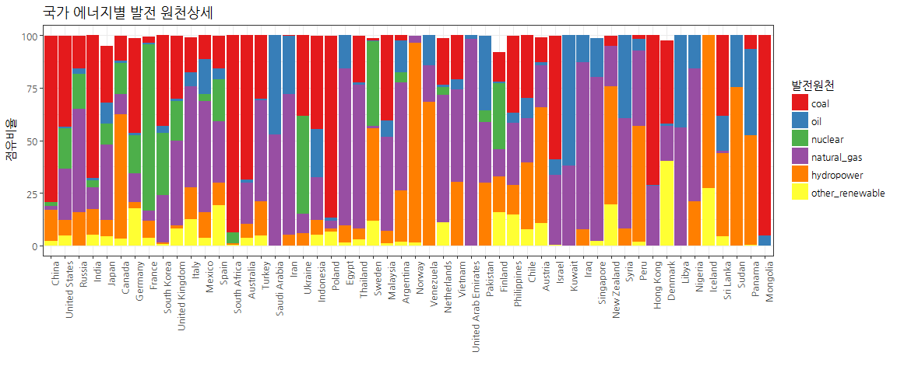
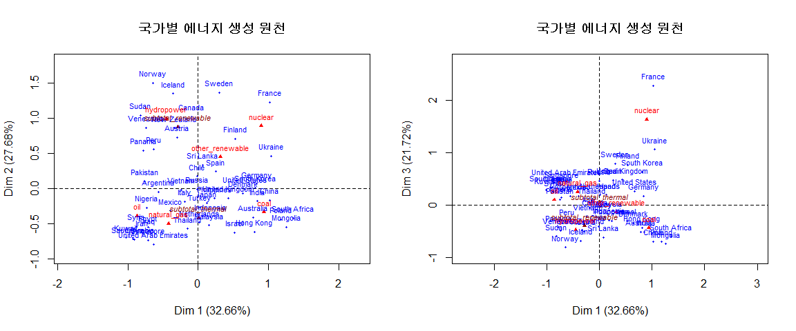

# 데이터 과학

## 1. 국가별 발전 데이터 {#data}

국가별 발전 데이터는 위키피디아 [List of countries by electricity production](https://en.wikipedia.org/wiki/List_of_countries_by_electricity_production) 페이지에서 
확인할 수 있다. 이 데이터를 바탕으로 각 국가별로 신재생 에너지를 포함하여 다양한 발전에 사용되는 자원에 대해 살펴본다.
특히, 전기 발전 데이터가 관심을 갖는 이유는 최근 [한국 미세먼지 원인 “국내 52%, 중국 34%”](http://news.kbs.co.kr/news/view.do?ncd=3519126&ref=D) 뉴스에서도 얻급 되었듯이 일상생활과 밀접한 관계가 있기 때문이다.

## 2.  국가별 발전 패턴 분석 {#production-analysis}

국가별 데이터 분석을 위해서 데이터 분석환경을 다음과 같이 설정한다.

- 데이터와 사투: tidyverse, stringr
- 웹데이터 긁어오기: rvest
- 시각화: ggplot2, ggthemse, extrafonts
- 탐색적 데이터 분석: FactoMineR
- 범주형 데이터 시각화: ggmosaic

### 2.1. 환경설정 {#setting}

~~~{.r}
# 0. 환경설정 -----------------------------------
library(tidyverse)
library(stringr)
library(rvest)
library(ggplot2)
library(ggthemes)
library(ggmosaic) # devtools::install_github("haleyjeppson/ggmosaic")
library(extrafont)
library(FactoMineR)
loadfonts()
~~~

### 2.2. 데이터 가져오기 {#ingest}

[List of countries by electricity production](https://en.wikipedia.org/wiki/List_of_countries_by_electricity_production) 웹페이지에서 
웹크로링한다. `stringr` 팩키지 함수를 활용하여 문자열 데이터를 숫자형으로 변형하기 위해서 전처리 작업도 함께 병행한다.

~~~{.r}
# 1. 원전 데이터 ---------------------
# 국가별 전력 생산
url <- "https://en.wikipedia.org/wiki/List_of_countries_by_electricity_production"

energy <- url %>%
    read_html() %>%
    html_nodes(xpath='//*[@id="mw-content-text"]/div/table[2]') %>%
    html_table(fill = TRUE) %>% 
    .[[1]]

# 2. 데이터 전처리 ---------------------
colnames(energy) <- c("country", "Electricity production\n(TWh)", "coal", 
                      "natural_gas", "oil", "subtotal_thermal", "hydropower", 
                      "other_renewable", "subtotal_renewable", "nuclear")
  
energy_df <- energy %>% filter(country != "Country") %>% 
    mutate(coal = as.numeric(str_replace(coal, "%", "")),
           natural_gas = as.numeric(str_replace(natural_gas, "%", "")),
           oil = as.numeric(str_replace(oil, "%", "")),
           hydropower = as.numeric(str_replace(hydropower, "%", "")),
           other_renewable = as.numeric(str_replace(other_renewable, "%", "")),
           nuclear = as.numeric(str_replace(nuclear, "%", "")),
           subtotal_thermal = as.numeric(str_replace(subtotal_thermal, "%", "")),
           subtotal_renewable = as.numeric(str_replace(subtotal_renewable, "%", ""))) %>% 
    dplyr::rename(발전량 = `Electricity production\n(TWh)`) %>% 
    mutate(발전량 = as.numeric(str_replace(발전량, ",", ""))) %>% 
    filter(country != "World") %>% 
    column_to_rownames(var="country")
~~~

## 3. 국가별 발전 시각화 {#mosaic-viz}

### 3.1. 막대그래프를 활용 비율 시각화 {#stacked-barchart}

우선 원본데이터가 발전량과 각 발전 에너지원별로 나눠져서 있어 이를 `ggplot`을 활용하여 시각화한다. 
국가별 발전 데이터가 원천별로 퍼센트(%) 비율로 정리되어 있어 바로 쌓은 막대그래프(stacked barchart) geom을 적용하여 시각화한다. 또한, 국가별 발전량을 고려하여 가장 많은 전기를 생산하는 국가부터 정렬하여 순서대로 표현한다.

~~~{.r}
# 3. 시각화 ---------------------

## 3.1. 발전량 순위별 에너지 원천 -----------
energy_df %>% 
    rownames_to_column(var="country") %>% 
    select(-contains("subtotal_"), 국가=country) %>% 
    filter(국가 != "World") %>% 
    arrange(desc(발전량)) %>% 
    gather(에너지, 비율, -국가, -발전량) %>% 
    mutate(에너지 = factor(에너지, levels=c("coal", "oil", "nuclear", "natural_gas", "hydropower", "other_renewable"))) %>% 
    # filter(에너지 !="발전량") %>% 
    ggplot(data = ., aes(x=reorder(국가, -발전량), y=비율, fill=에너지)) +
    geom_bar(stat="identity") +
    labs(x="", y="점유비율", title='국가 에너지별 발전 원천상세', fill="발전원천") + 
    theme_bw(base_family="NanumGothic") +
    theme(axis.text.x = element_text(angle = 90, hjust = 1),
          legend.position='right', legend.direction='vertical') +
    scale_fill_brewer(palette="Set1")
~~~

### 3.2. 모자이크 그래프를 적용한 국가별 발전량 시각화 {#mosaic-viz}

앞선 그래프가 발전량 순서로 정렬하여 표현하였지만, 이를 실제적으로 반영하는데 모자이크 그래프를 활용한다.
발전량과 비율로 된 것을 실제 발전량으로 변환하여 모자이크 그래프로 시각화하게 되면 한눈에 발전량과 함께 
국가별로 발전에 어떤 자원을 투입하는지도 명확히 확인된다.

~~~{.r}
## 3.2. 발전량 고려 -----------
energy_actual_df <- energy_df %>% 
    rownames_to_column(var="국가") %>% 
    mutate(coal = 발전량 * coal/100,
           natural_gas = 발전량 * natural_gas/100,
           oil = 발전량 * oil/100,
           hydropower = 발전량 * hydropower/100,
           other_renewable = 발전량 * other_renewable/100,
           nuclear = 발전량 * nuclear/100) %>% 
        select(국가, 석탄=coal, 천연가스=natural_gas, 석유=oil, 수력=hydropower, 신재생=other_renewable, 원자력=nuclear)

energy_actual_df %>% 
    gather(에너지, 생산량, -국가) %>% 
    mutate(에너지 = factor(에너지, levels=c("석탄", "석유", "천연가스", "수력", "신재생", "원자력"))) %>% 
    ggplot(data = .) +
    geom_mosaic(aes(weight = 생산량, x = product(reorder(국가, -생산량)), fill=factor(에너지)), na.rm=TRUE) +
    labs(x="", title='국가 에너지별 발전 원천상세') + 
    theme_bw(base_family="NanumGothic") +
    theme(axis.text.x = element_text(angle = 90, hjust = 1),
          legend.position='right', legend.direction='vertical') +
    scale_fill_brewer(palette="Set1") +
    guides(fill=guide_legend(title = "에너지", reverse = TRUE))
~~~

## 4. 대응분석 {#ca}

대응분석을 통해 1,2차원이 약 60%를 설명하는데 `Dim 1` 차원은 석유와 원자력이 우측에 위치하고 석유가 반대쪽에 위치한 것으로 봐서 **가성비**로 잠정 볼 수 있고, `Dim 2` 차원은 수력과 신재생이 윗쪽에 석유, 석탄, 천연가스가 아래쪽에 위치한 것으로 봐서 **친환경**으로 잠정 볼 수 있다. 특히, 신재생과 열을 이용한 발전합계(subtotal_renewable, subtotal_thermal)이 위와 아래 각각 위치한 것도 차원식별에 도움이 된다.

대한민국은 독일, 미국, 덴마크와 유사한 패턴을 보이고 있다. 눈여겨 볼 것은 **러시아**가 위키피디아 발전패턴의 평균적인 모습을 보이고 있다.

~~~{.r}
# 4. 대응분석 ---------------------
energy_ca_df <- energy_df[,-1]
energy_ca <- CA(energy_ca_df, col.sup=c(4,7))
~~~

~~~{.r}
summary(energy_ca)
~~~

~~~{.output}

Call:
CA(X = energy_ca_df, col.sup = c(4, 7)) 

The chi square of independence between the two variables is equal to 7296.971 (p-value =  0 ).

Eigenvalues
                       Dim.1   Dim.2   Dim.3   Dim.4   Dim.5
Variance               0.461   0.390   0.306   0.154   0.099
% of var.             32.665  27.685  21.723  10.934   6.994
Cumulative % of var.  32.665  60.349  82.072  93.006 100.000

Rows (the 10 first)
                       Iner*1000    Dim.1    ctr   cos2    Dim.2    ctr
Argentina            |     7.421 | -0.564  1.334  0.828 | -0.050  0.012
Australia            |    20.421 |  0.780  2.553  0.576 | -0.411  0.836
Austria              |    18.272 | -0.298  0.368  0.093 |  0.727  2.588
Canada               |    22.563 | -0.089  0.033  0.007 |  1.026  5.197
Chile                |     3.911 | -0.015  0.001  0.001 |  0.173  0.148
China                |    31.600 |  1.017  4.334  0.632 | -0.168  0.140
Hong Kong            |    24.921 |  0.806  2.723  0.503 | -0.618  1.889
Denmark              |    54.195 |  0.636  1.657  0.141 | -0.070  0.024
Egypt                |    19.801 | -0.710  2.117  0.493 | -0.556  1.534
Finland              |    27.005 |  0.531  1.085  0.185 |  0.708  2.282
                       cos2    Dim.3    ctr   cos2  
Argentina             0.006 |  0.178  0.200  0.083 |
Australia             0.160 | -0.511  1.647  0.247 |
Austria               0.553 | -0.497  1.542  0.259 |
Canada                0.899 | -0.125  0.099  0.013 |
Chile                 0.148 | -0.412  1.070  0.838 |
China                 0.017 | -0.694  3.030  0.294 |
Hong Kong             0.296 | -0.428  1.158  0.142 |
Denmark               0.002 | -0.335  0.691  0.039 |
Egypt                 0.303 |  0.301  0.571  0.088 |
Finland               0.330 |  0.763  3.378  0.383 |

Columns
                       Iner*1000     Dim.1     ctr    cos2     Dim.2
coal                 |   302.525 |   0.939  47.738   0.727 |  -0.340
natural_gas          |   196.762 |  -0.418  12.047   0.282 |  -0.501
oil                  |   192.789 |  -0.865  17.632   0.421 |  -0.393
hydropower           |   288.179 |  -0.451   8.775   0.140 |   0.996
other_renewable      |   118.715 |   0.321   1.216   0.047 |   0.448
nuclear              |   311.319 |   0.898  12.592   0.186 |   0.891
                         ctr    cos2     Dim.3     ctr    cos2  
coal                   7.376   0.095 |  -0.436  15.494   0.157 |
natural_gas           20.399   0.405 |   0.257   6.825   0.106 |
oil                    4.307   0.087 |   0.099   0.349   0.006 |
hydropower            50.483   0.684 |  -0.472  14.474   0.154 |
other_renewable        2.794   0.092 |  -0.128   0.291   0.008 |
nuclear               14.643   0.184 |   1.632  62.567   0.616 |

Supplementary columns
                        Dim.1   cos2    Dim.2   cos2    Dim.3   cos2  
subtotal_thermal     |  0.011  0.001 | -0.424  0.984 | -0.024  0.003 |
subtotal_renewable   | -0.285  0.078 |  0.879  0.735 | -0.399  0.151 |

~~~

~~~{.r}
par(mfrow=c(1,2))
plot(energy_ca, shadow=TRUE, cex=0.7, title="국가별 에너지 생성 원천")
#plot(energy_ca, invisible=c("col.sup"), shadow=TRUE, cex=0.7, title="국가별 에너지 생성 원천")
plot(energy_ca, axes=c(1,3), shadow=TRUE, cex=0.7, title="국가별 에너지 생성 원천")
~~~

### 4.1. 분석에 사용된 데이터 {#ca-table}

`DT` 팩키지를 통해 시각적으로 확인된 사항을 표를 통해 면밀한 검토도 추가로 가능하다.

~~~{.r}
energy %>% 
    filter(country != "Country") %>% 
    DT::datatable()
~~~

<!--html_preserve-->

<!--/html_preserve-->
