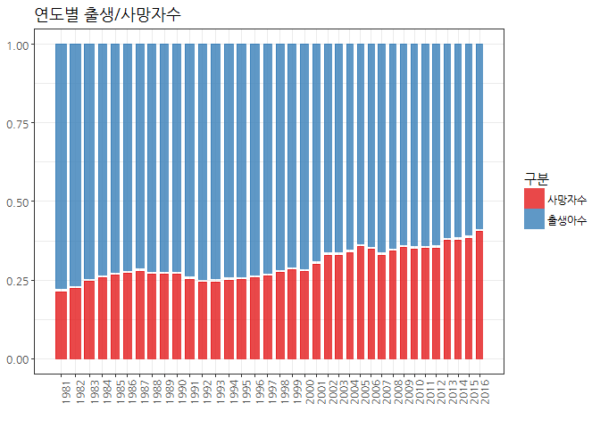
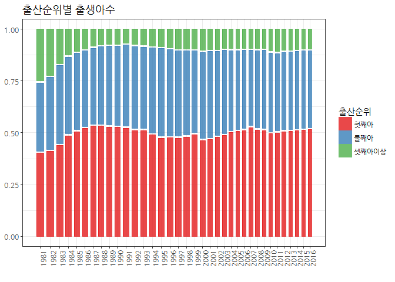

# 데이터 과학

## 1. 통계청 출생, 사망 통계 

[2016년 출생.사망통계 잠정 결과](http://kostat.go.kr/portal/korea/kor_nw/2/1/index.board?bmode=read&bSeq=&aSeq=359243&pageNo=1&rowNum=10&navCount=10&currPg=&sTarget=title&sTxt)가 
2017년 2월 22일 발표되었다. 
다양한 그래프를 통해 출생 및 사망에 관한 통계 정보가 공개 되었다. 

## 2. 범주형 데이터 시각화

그래프 문법(Grammar of Graphics)을 사용한 모자이크 그래프(https://cran.r-project.org/web/packages/ggmosaic/index.html)를 통해 출생에 관한 비밀을 
시각적으로 풀어보자.

### 2.1. 환경설정

`ggmosaic`이 가장 중심적인 팩키지다. 엑셀파일(`readxl`)을 읽어오고, 데이터와 사투를 벌이는데 사용되는 `tidyverse`, 
그리고 한글 글꼴과 테마 적용을 위한 팩키지를 준비한다.

~~~{.r}
library(tidyverse)
library(ggplot2)
library(ggthemes)
library(readxl)
library(ggmosaic) # devtools::install_github("haleyjeppson/ggmosaic")
library(extrafont)
loadfonts()
~~~

### 2.2. 출생과 사망 추이

가장 먼저 출생과 사망에 대한 추이를 모자이크 그래프를 통해 시각화한다.

~~~{.r}
# 1. 출생사망 ------------------------------
birth_death_df <- read_excel("data/통계청_인구통계_2016.xlsx", sheet="출생사망")

DT::datatable(birth_death_df) %>% 
    DT::formatRound(c(2,3,4), digits=0)
~~~

<!--html_preserve-->

<!--/html_preserve-->

~~~{.r}
birth_death_df %>% 
    select(연도, 출생아수, 사망자수) %>% 
    gather(구분, 출생사망수, -연도) %>% 
    ggplot(data = .) +
    geom_mosaic(aes(weight = 출생사망수, x = product(구분, 연도), fill=factor(구분)), na.rm=TRUE) +
    labs(x="", title='연도별 출생/사망자수', fill="구분") + 
    theme_bw(base_family="NanumGothic") +
    theme(axis.text.x = element_text(angle = 90, hjust = 1),
          legend.position='right', legend.direction='vertical')  +
    scale_fill_brewer(palette="Set1")
~~~

### 2.3. 산모나이를 고려한 출산 추이

산모 연령별로 출생자수 변화를 연도별로 시각화한다.

~~~{.r}
# 2. 산모나이 ------------------------------

mother_age_df <- read_excel("data/통계청_인구통계_2016.xlsx", sheet="산모나이")

DT::datatable(mother_age_df)  %>% 
    DT::formatRound(c(2:9), digits=0)
~~~

<!--html_preserve-->

<!--/html_preserve-->

~~~{.r}
mother_age_df %>% 
    select(-합계) %>% 
    gather(연령대, 신생아수, -연도) %>% 
    mutate(연령대 = factor(연령대)) %>% 
    ggplot(data = .) +
    geom_mosaic(aes(weight = 신생아수, x = product(연령대, 연도), fill=factor(연령대)), na.rm=TRUE) +
    labs(x="", title='연령대별 출생아수', fill="연령대") + 
    theme_bw(base_family="NanumGothic") +
    theme(axis.text.x = element_text(angle = 90, hjust = 1),
          legend.position='right', legend.direction='vertical') +
    scale_fill_brewer(palette="Set1")
~~~

### 2.4. 출산 순위를 반영한 연도별 추이

신생아의 출산순의를 반영한 연도별 추이를 살펴본다.

~~~{.r}
# 3. 출산순위 ------------------------------

birth_order_df <- read_excel("data/통계청_인구통계_2016.xlsx", sheet="출산순위")

DT::datatable(birth_order_df)  %>% 
    DT::formatRound(c(2,3,4, 5), digits=0)
~~~

<!--html_preserve-->

<!--/html_preserve-->

~~~{.r}
birth_order_df %>% 
    select(-합계) %>% 
    gather(출산순위, 신생아수, -연도) %>% 
    mutate(출산순위 = factor(출산순위, levels=c("첫째아", "둘째아", "셋째아이상"))) %>% 
    ggplot(data = .) +
    geom_mosaic(aes(weight = 신생아수, x = product(출산순위, 연도), fill=factor(출산순위)), na.rm=TRUE) +
    labs(x="", title='출산순위별 출생아수', fill="출산순위") + 
    theme_bw(base_family="NanumGothic") +
    theme(axis.text.x = element_text(angle = 90, hjust = 1),
          legend.position='right', legend.direction='vertical')  +
    scale_fill_brewer(palette="Set1")
~~~

