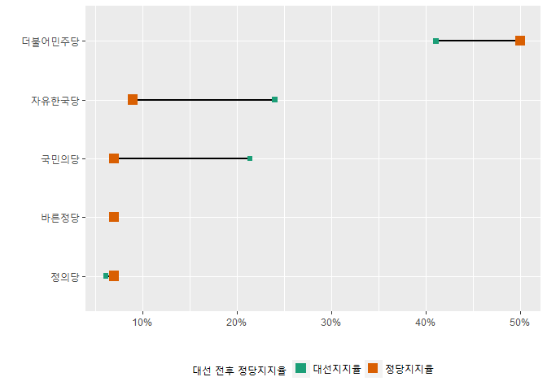
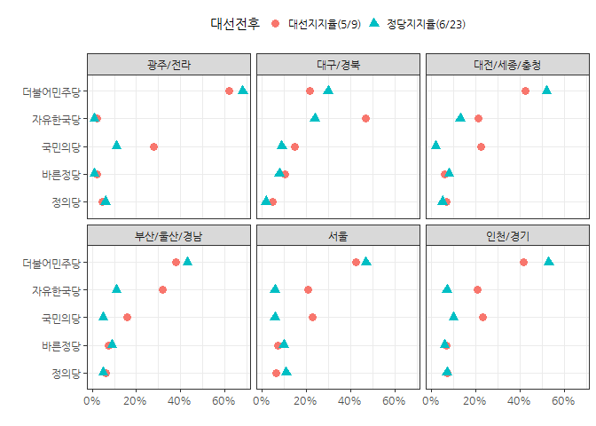

# 데이터 과학

## 1. 전후 변화  

전후 변화를 시각적으로 나타내는 비교하는 것이 의미가 있는 경우가 크다. 
예를 들어, 대선전후 대통령 득표율과 현재 정당지지율 변화를 시각화해보자.

### 1.1. 데이터 가져오기

나무위키 웹사이트 [제19대 대통령 선거](https://namu.wiki/w/%EC%A0%9C19%EB%8C%80%20%EB%8C%80%ED%86%B5%EB%A0%B9%20%EC%84%A0%EA%B1%B0) 웹사이트에서 
대통령 선거에서 얻은 득표와 득표율 데이터을 긁어와서 이를 기준 지지율 정보를 삼는다.

~~~{.r}
# 0. 환경설정 -------------------------------------
#library(rvest)
#library(tidyverse)
#library(stringr)
#library(extrafont)
#library(ggthemes)
#library(readxl)
#library(reshape2)
#library(RColorBrewer)
#loadfonts()

# 1. 데이터 가져오기 -------------------------------------
## 1.1. 대선 득표율 --------------------------------------
namu_url <- "https://namu.wiki/w/%EC%A0%9C19%EB%8C%80%20%EB%8C%80%ED%86%B5%EB%A0%B9%20%EC%84%A0%EA%B1%B0"
namu_html <- read_html(namu_url, encoding="UTF-8")

# Sys.setlocale("LC_ALL", "Korean")

gallop_tbl <- html_table(namu_html, fill=TRUE) [[7]] # 7번표 6. 여론조사 
vote_tbl <- html_table(namu_html, fill=TRUE) [[18]] # 18번표 투표율
earned_vote_tbl <- html_table(namu_html, fill=TRUE) [[23]] # 23번표 후보별 득표율
earned_vote_region_tbl <- html_table(namu_html, fill=TRUE) [[25]]  # 25번표 후보별 상세득표율

# write_csv(gallop_tbl,"data/gallop_tbl.csv")
# write_csv(vote_tbl, "data/vote_tbl.csv")
# write_csv(earned_vote_tbl, "data/earned_vote_tbl.csv")
# write_csv(earned_vote_region_tbl, "data/earned_vote_region_tbl.csv")

## 1.2. 정당 지지율 --------------------------------------
gallop_dat <- read_csv("data/갤럽_20170623.csv")

# 2. 데이터 정제 -------------------------------------

gallop_tbl  <- read_csv("data/gallop_tbl.csv")
votes_tbl  <- read_csv("data/vote_tbl.csv", col_names = FALSE, skip=3)
votes_pcnt_tbl <- read_csv("data/earned_vote_tbl.csv", col_names = FALSE, skip=3)
votes_region_tbl <- read_csv("data/earned_vote_region_tbl.csv", col_names = FALSE, skip=5)
~~~

### 1.2. 데이터 가공

웹에서 긁어온 데이터를 R에서 데이터 분석과 시각화가 가능한 형태로 데이터프레임으로 가공하는 작업을 수행한다.

~~~{.r}
득표율_df <- votes_pcnt_tbl %>% dplyr::rename("기호" = X1,
                                 "후보" = X2,
                                 "정당" = X3,
                                 "득표수" = X4,
                                 "득표율" = X5,
                                 "순위" = X6,
                                 "당선여부" = X7) %>% 
  dplyr::filter(기호 != 11,  기호 != 13, 기호 !="선거인수", 기호 != "무효표수") %>% 
  mutate(득표수 = as.numeric(str_replace_all(득표수, ",", "")),
         득표율 = as.numeric(str_replace_all(득표율, "%", ""    ))) %>% 
  dplyr::filter(후보 %in% c("문재인", "홍준표", "안철수", "유승민", "심상정")) %>% 
  mutate(후보 = factor(후보, levels=c("문재인", "홍준표", "안철수", "유승민", "심상정")))

시도득표수_df <- votes_region_tbl %>% dplyr::rename(시도 = X1,
                                   문재인 = X2,
                                   홍준표 = X3,
                                   안철수 = X4,
                                   유승민 = X5,
                                   심상정 = X6) %>%
  mutate(문재인 = strsplit(문재인, "\\("), 
         홍준표 = strsplit(홍준표, "\\("),
         안철수 = strsplit(안철수, "\\("), 
         유승민 = strsplit(유승민, "\\("), 
         심상정 = strsplit(심상정, "\\(")) %>% 
  unnest(문재인, 홍준표, 안철수, 유승민, 심상정) %>% 
  dplyr::filter(row_number(시도) %% 2 != 0) %>% 
  mutate(문재인 = as.numeric(str_replace_all(문재인, ",", "")),
         홍준표 = as.numeric(str_replace_all(홍준표, ",", "")),
         안철수 = as.numeric(str_replace_all(안철수, ",", "")),
         유승민 = as.numeric(str_replace_all(유승민, ",", "")),
         심상정 = as.numeric(str_replace_all(심상정, ",", "")))
  
시도득표율_df <- votes_region_tbl %>% dplyr::rename(시도 = X1,
                                                문재인 = X2,
                                                홍준표 = X3,
                                                안철수 = X4,
                                                유승민 = X5,
                                                심상정 = X6) %>%
  mutate(문재인 = strsplit(문재인, "\\("), 
            홍준표 = strsplit(홍준표, "\\("),
            안철수 = strsplit(안철수, "\\("), 
            유승민 = strsplit(유승민, "\\("), 
            심상정 = strsplit(심상정, "\\(")) %>% 
  unnest(문재인, 홍준표, 안철수, 유승민, 심상정) %>% 
  dplyr::filter(row_number(시도) %% 2 != 1) %>% 
  mutate(문재인 = as.numeric(str_replace_all(문재인, "%|\\)", "")),
         홍준표 = as.numeric(str_replace_all(홍준표, "%|\\)", "")),
         안철수 = as.numeric(str_replace_all(안철수, "%|\\)", "")),
         유승민 = as.numeric(str_replace_all(유승민, "%|\\)", "")),
         심상정 = as.numeric(str_replace_all(심상정, "%|\\)", "")))

gallop_df <- gallop_dat %>% dplyr::select(더불어민주당 = 민주당, 자유한국당, 국민의당, 바른정당, 정의당) %>% 
  mutate_if(is.character, as.numeric)
~~~

~~~{.output}
Warning in eval(substitute(expr), envir, enclos): NAs introduced by
coercion

Warning in eval(substitute(expr), envir, enclos): NAs introduced by
coercion

Warning in eval(substitute(expr), envir, enclos): NAs introduced by
coercion

Warning in eval(substitute(expr), envir, enclos): NAs introduced by
coercion

Warning in eval(substitute(expr), envir, enclos): NAs introduced by
coercion

~~~

~~~{.r}
gallop_df <- bind_cols(tibble(시도=gallop_dat$시도), gallop_df)

# 3. 데이터 병합 -------------------------------------
current_df <- gallop_df %>% dplyr::filter(시도 == "전체") %>% 
  gather(정당, 정당지지율, -시도) %>% 
  dplyr::select(-시도)
past_df <- 득표율_df %>% 
  mutate(득표율 = 득표율 / 100) %>% 
  dplyr::select(정당, 대선지지율 = 득표율)

정당지지율_df <- inner_join(past_df, current_df, by="정당")
~~~

### 1.3. 시각화

갤럽에서 최근(6월23일)에 조사한 데이터와 대선 각 후보별 득표율과 정당지지율을 한데 모아 이를 시각화한다.

~~~{.r}
# 3. 시각화 -------------------------------------

colors <- brewer.pal(8, "Dark2")

정당지지율_df %>% 
  mutate(정당 = factor(정당, levels=c("정의당", "바른정당", "국민의당", "자유한국당", "더불어민주당"))) %>% 
  ggplot(data=., aes(x = reorder(대선지지율, 정당), y = 대선지지율)) +
    geom_segment(aes(x = 정당지지율_df$"대선지지율",
                     y = 정당,
                     xend = 정당지지율_df$"정당지지율",
                     yend = 정당),
                     size = 1) +
    geom_point(aes(x = 정당지지율_df$"대선지지율",y=정당,
                    color = "대선지지율"),
                    size = 2, shape = 15) +
    geom_point(aes(x = 정당지지율_df$"정당지지율",y=정당,
                   color = "정당지지율"),
               size = 4, shape = 15) +
    scale_color_manual(name = "대선 전후 정당지지율", # or name = element_blank()
                       labels = c("대선지지율", "정당지지율"),
                       values = colors) +
    theme(legend.position = "bottom") +
    labs(x="", y="") +
    scale_x_continuous(labels = scales::percent)
~~~

## 2. 시도별 지지율 변화 

전국적으로 정당별 지지율 변화를 살펴봤으면, 시도별 지지율 변화를 살펴보자. 
갤럽조사에서 시도를 `인천/경기`, "대전/세종/충청", "광주/전라", "부산/울산/경남"와 같은 식으로 
묶어 지지율도 다시 계산한다. 

그리고 나서, 시도별로 조인하여 시각화한다.

~~~{.r}
geometric.mean <- function(x, na.rm=TRUE){
  exp(sum(log(x[x > 0]), na.rm=na.rm) / length(x))
}

# 3. 데이터 병합 -------------------------------------
current_sido_df <- gallop_df %>% dplyr::filter(시도 != "전체", 시도 !="강원") %>% 
  dplyr::rename(새시도=시도) %>% 
  gather(정당, 정당지지율, -새시도)

past_sido_df <- 시도득표율_df %>% 
  mutate(새시도 = dplyr::recode(시도, 
                               "인천" = "인천/경기",
                               "경기" = "인천/경기",
                               "대전" = "대전/세종/충청",
                               "세종" = "대전/세종/충청",
                               "충남" = "대전/세종/충청",
                               "충북" = "대전/세종/충청",
                               "광주" = "광주/전라",
                               "전남" = "광주/전라",
                               "전북" = "광주/전라",
                               "대구" = "대구/경북",
                               "경북" = "대구/경북",
                               "부산" = "부산/울산/경남",
                               "울산" = "부산/울산/경남",
                               "경남" = "부산/울산/경남",
                               "제주" = "제주",
                               "강원" = "강원")) %>% 
  group_by(새시도) %>% 
  dplyr::summarize(문재인 = geometric.mean(문재인),
                   홍준표 = geometric.mean(홍준표),
                   안철수 = geometric.mean(안철수),
                   유승민 = geometric.mean(유승민),
                   심상정 = geometric.mean(심상정)) %>% 
  dplyr::rename(더불어민주당=문재인,
                      자유한국당=홍준표,
                      국민의당=안철수,
                      바른정당=유승민,
                      정의당=심상정) %>% 
  dplyr::filter(새시도 != "강원") %>%
  gather(정당, 대선지지율, -새시도) %>% 
  mutate(대선지지율 = 대선지지율 /100)

시도지지율_df <- inner_join(past_sido_df, current_sido_df, by=c("정당","새시도"))

# 3. 시각화 -------------------------------------

## 3.2. 경쟁적 배타관계 -------------------------------------
colors <- brewer.pal(8, "Dark2")

시도지지율_df %>% 
  dplyr::rename(`대선지지율(5/9)` = 대선지지율, `정당지지율(6/23)` = 정당지지율) %>%  
  mutate(정당 = factor(정당, levels=c("정의당", "바른정당", "국민의당", "자유한국당", "더불어민주당"))) %>% 
  gather(대선전후, 지지율, -정당, -새시도) %>% 
  ggplot(data=., aes(x = 정당, y = 지지율), group=새시도) +
    geom_point(aes(color=대선전후, shape=대선전후), size=3) +
    facet_wrap(~새시도) +
    coord_flip() +
    scale_y_continuous(labels = scales::percent) +
    scale_fill_manual(values = party_color) +
    theme_bw(base_family="NanumGothic") +
    theme(legend.position = "top") +
    labs(x="", y="")
~~~

