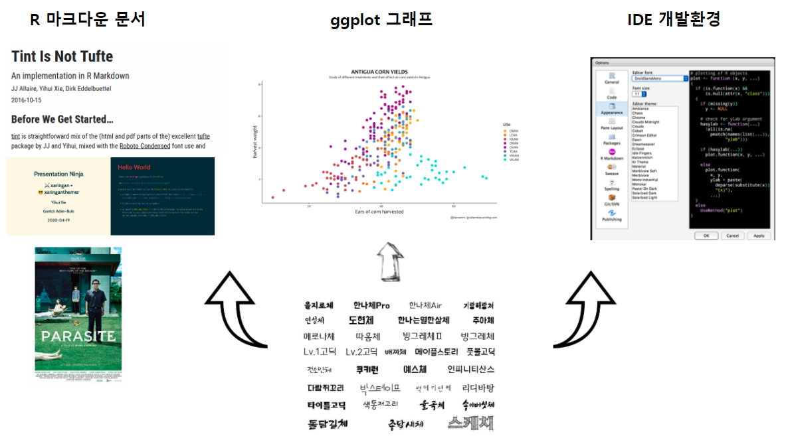

```{r setup, include=FALSE}
knitr::opts_chunk$set(echo = TRUE, warning=FALSE, message=FALSE,
                    comment="", digits = 3, tidy = FALSE, prompt = FALSE, fig.align = 'center')

library(tidyverse)
library(scales)
library(showtext) # 글꼴, install.packages("showtext")
library(extrafont)
loadfonts()
```



R을 활용하면 데이터 과학 산출물을 다양한 전자문서로 제작하여
커뮤니케이션 할 수 있다.\
PDF, HTML, 워드 등 문서 뿐만 아니라, 파워포인트 같은 발표자료를
슬라이드로 제작하여 배포할 수 있다. 그래프 문법에 따라 ggplot을 시각화를
산출물에도 다양한 글꼴을 반영하여 좀더 관심을 끌 수 있는 그래프를
제작하는 것도 가능하다. 데이터 과학자 관점에서 통합개발환경(IDE)이
필요한데 개발과 저작에 집중할 수 있는 글꼴을 지정하여 활용할 경우
생산성도 높일 수 있고 좀더 쾌적한 환경에서 개발을 진행할 수 있다.

------------------------------------------------------------------------

R 스크립트 작성을 위한 글꼴과 그래프에 한글 글꼴(font)을 적용한다.
`ggplot`을 비롯한 시각화를 위해 `extrafont`와 `showtext` 팩키지를
활용하여 한글 글꼴을 사용하고 특히 R 스크립트(`.R`) 및
R마크다운(`.Rmd`)에서 한글글꼴 사용을 위해서 코딩관련 글꼴도 설치한다.

기본적인 작업흐름은 운영체제에 먼저 외부에서 가져온 폰트를 설치한다.
그리고 나서 `extrafont` 팩키지 `font_import()` 함수를 사용해서 폰트를
R에서 불러 사용할 수 있도록 설치한다. 그리고 나서 `loadfonts()` 함수를
사용해서 글꼴을 `ggplot`등에서 불러 사용한다.


# RStdio IDE R 코딩 개발 글꼴 {#r-coding-font}

문서를 위해 작성하는데 사용되는 글꼴과 R 코딩을 위해 사용되는 글꼴은
차이가 난다. 왜냐하면 R 코딩에 사용되는 글꼴은 가독성이 좋아야하고
디버깅에 용이해야 된다. 영어는 `consolas` 글꼴을 많이 사용하는데 무료가
아니다. 그래서 `consolas`에서 영감을 받은 SIL 오픈 폰트 라이선스를
따르는 [Inconsolata](https://en.wikipedia.org/wiki/Inconsolata)가 R
코딩에 많이 사용되고 있다. 하지만, R코드를 작성할 때 주석을 한글로
달거나 R마크다운 작업을 할 경우 유사한 기능을 하는 한글 글꼴이 필요하다.

-   [네이버 나눔고딕
    코딩글꼴](https://github.com/naver/nanumfont/blob/master/README.md)
-   [D2 Coding 글꼴](https://github.com/naver/d2codingfont)

"네이버 나눔고딕 코딩글꼴"과 "D2 Coding 글꼴"을 설치하고 나서 RStudio
IDE에서 "Tools " → "Global Options..."를 클릭하면 "Options"창에서
`Appearance`에서 **Editor font:**에서 설치한 코딩전용 글꼴을 선택하고
**Editor theme:**도 지정한다.


# `ggplot` 시각화 글꼴 {#r-viz-font}

## 글꼴 설치 {#r-viz-font-setup}

`extrafont` 팩키지에서 `font_import()` 함수로 운영체제(윈도우/리눅스)에
설치된 글꼴을 R로 가져온다. 그리고 나서 `loadfonts()` 함수를 사용해서
설치된 글꼴을 사용하는 작업흐름을 따르게 된다.

```{r extrafont-in-r, eval=FALSE}
library(extrafont)
font_import(pattern = "D2")

Importing fonts may take a few minutes, depending on the number of fonts and the speed of the system.
Continue? [y/n] y
Scanning ttf files in C:\Windows\Fonts ...
Extracting .afm files from .ttf files...
C:\Windows\Fonts\D2Coding-Ver1.3.2-20180524.ttf => C:/Users/tidyverse_user/Documents/R/win-library/3.5/extrafontdb/metrics/D2Coding-Ver1.3.2-20180524
C:\Windows\Fonts\D2CodingBold-Ver1.3.2-20180524.ttf => C:/Users/tidyverse_user/Documents/R/win-library/3.5/extrafontdb/metrics/D2CodingBold-Ver1.3.2-20180524
C:\Windows\Fonts\MOD20.TTF => C:/Users/tidyverse_user/Documents/R/win-library/3.5/extrafontdb/metrics/MOD20
Found FontName for 3 fonts.
Scanning afm files in C:/Users/tidyverse_user/Documents/R/win-library/3.5/extrafontdb/metrics
Writing font table in C:/Users/tidyverse_user/Documents/R/win-library/3.5/extrafontdb/fontmap/fonttable.csv
Writing Fontmap to C:/Users/tidyverse_user/Documents/R/win-library/3.5/extrafontdb/fontmap/Fontmap...

font_import(pattern = "Nanum")
```

## `ggplot` 한글 글꼴 사례 {#r-viz-font-example}

```{r ggplot-extrafont-in-r}
library(tidyverse)
library(extrafont)
loadfonts()

iris %>% 
  ggplot(aes(x=Sepal.Length, y=Petal.Length, color=Species)) +
    geom_point()+
    labs(title="붓꽃 데이터 한글 글꼴 적용", color="붓꽃 종류") +
    theme_minimal(base_family = "Nanum Pen Script") +
    theme(legend.position = "top")

```

# `showtext` 팩키지 [^1] {#korean-font}

[^1]: [showtext: Using Fonts More Easily in R
    Graphs](https://cran.rstudio.com/web/packages/showtext/index.html)

[extrafont](https://github.com/wch/extrafont) 팩키지를 통해 한자를
포함한 한글을 처리할 수 있었으나,
[extrafont](https://github.com/wch/extrafont)는 트루타입폰트(`.ttf`)를
PDF 그래픽 장치에 초점을 맞춰 개발이 되었다. 따라서, 데이터과학
최종산출물이 책이 아닌 경우 여러가지 면에서 다양한 한글 글꼴을
표현하는데 있어 한계가 있다.

새로 개발된
[showtext](https://cran.rstudio.com/web/packages/showtext/index.html)
팩키지는 `Ghostscript`같은 외부 소프트웨어를 활용하지 않고도 다양한
(그래픽) 글꼴을 지원한다.
[showtext](https://cran.rstudio.com/web/packages/showtext/index.html)로
R 그래프를 생성할 때, 다양한 글꼴(TrueType, OpenType, Type 1, web fonts
등)을 지원한다.


사용자가 그래프프에 텍스트를 넣기 위해 R 함수에서 `text()`를 호출할 때
`showtext`가 활성화 되어 있으면 `showtext` 팩키지 `text()` 함수를
호출해서 그래픽 혹은 이미지 파일에 텍스트를 표현하고 그렇지 않는 경우는
디폴트 장치함수 `text()` 함수를 호출하게 되어 있다.

내부적으로 상세 작동 로직은 글꼴 위치를 파악해서 글리프(glyph) 정보를
추출하고 비트맵 형식, 벡터그래픽 형식에 따라서 비트맵일 경우 `raster()`
장치함수를 호출하고, 벡터그래픽인 경우 `path()` 장치함수를 호출해서
기능을 수행한다.

## 한글 폰트 그래프 사용 {#showtext-korean-example}

### 환경설정 {#showtext-korean-example-setup}

`extrafont` 팩키지 `loadfonts()` 함수를 통해 `.ttf` 파일 정보를
확인한다. 아직 [구글 글끌](http://www.google.com/fonts) 페이지에서 한글
글꼴을 지원하지 않고 있다.

```{r showtext-font-setup, eval=FALSE}
# 0. 환경설정 --------------------------------------------------------------------------
library(tidyverse)
library(showtext) # 글꼴, install.packages("showtext")
library(extrafont)
loadfonts()
```

### 구글 글꼴 설치 및 기본 그래픽 {#showtext-korean-example-google}

```{r showtext-showtext-install, warn=FALSE, message=FALSE}
# 1. 기본(Base) 그래픽 --------------------------------------------------------------------------

## Loading Google fonts (http://www.google.com/fonts)
font.add.google("Gochi Hand", "gochi")
font.add.google("Schoolbell", "bell")

## Automatically use showtext to render text
showtext.auto()

set.seed(123)
## Manually open a graphics device if you run this code in RStudio
## x11()
hist(rnorm(1000), breaks = 30, col = "steelblue", border = "white",
     main = "", xlab = "", ylab = "")
title("Histogram of Normal Random Numbers", family = "bell", cex.main = 2)
title(ylab = "Frequency", family = "gochi", cex.lab = 2)
text(2, 70, "N = 1000", family = "bell", cex = 2.5)
```

### `ggplot` 글꼴 활용 {#showtext-korean-example-ggplot}

`ggplot`을 통해 showtext 활용 기본 작업흐름을 살펴본다.

1.  글꼴을 적재한다.
2.  그래픽 장치를 연다
3.  `showtext`를 통해 텍스트를 표시한다고 지정한다.
4.  그래프를 그린다.
5.  장치를 닫는다.

```{r showtext-showtext-ggplot}
# 2. ggplot 그래픽 --------------------------------------------------------------------------

dat <- data.frame(cond = factor(rep(c("A","B"), each=200)), 
                  rating = c(rnorm(200),rnorm(200, mean=.8)))

font_add_google("Schoolbell", "bell")

showtext.begin()

ggplot(dat, aes(x=rating)) + 
  geom_histogram(binwidth=.5)+ 
　annotate("text", 1, 2.1, family = "bell", size = 15, color="red", label = "histogram")
showtext.end()
```

### 한글 글꼴 그래픽으로 표현 {#showtext-korean-example-ttf}

로컬 컴퓨터에 저장된 `.ttf` 파일을 사용자 지정해서 가져온 후 이를
`ggplot`에 반영하여 한글을 R 그래프에 적용한다.

```{r showtext-showtext-korean}
# ３. 한글 그래픽 --------------------------------------------------------------------------
## 나눔펜　스크립트
font_add("NanumBarunGothic", "NanumBarunGothic.ttf")

showtext.auto()

p <- ggplot(NULL, aes(x = 1, y = 1)) + ylim(0.8, 1.2) +
  theme(axis.title = element_blank(), axis.ticks = element_blank(),
        axis.text = element_blank()) +
  annotate("text", 1, 1.1, family = "NanumBarunGothic", size = 15, color="red",
           label = "한글 사랑") +
  annotate("text", 1, 0.9, label = 'korean for "Hello, world!"',
           family = "NanumBarunGothic", size = 12)

print(p)
```

# 현대적인 서체 [^modern-text-features] [^blog-webfont] {#modern-text-features}

[^modern-text-features]: [Thomas Lin Pedersen(2021-02-06), "Modern Text Features in R", Tidyverse Blog](https://www.tidyverse.org/blog/2021/02/modern-text-features/)

[^blog-webfont]: [Naver D2 (2018-12-22), "웹 폰트 사용과 최적화의 최근 동향"](https://d2.naver.com/helloworld/4969726)

- [systemfonts](https://github.com/r-lib/systemfonts)
- [textshaping](https://github.com/r-lib/textshaping)
- [ragg](https://ragg.r-lib.org/)

<iframe src="//www.slideshare.net/slideshow/embed_code/key/oFCEP9OyFYxcP3" width="595" height="485" frameborder="0" marginwidth="0" marginheight="0" scrolling="no" style="border:1px solid #CCC; border-width:1px; margin-bottom:5px; max-width: 100%;" allowfullscreen> </iframe> <div style="margin-bottom:5px"> <strong> <a href="//www.slideshare.net/NicolasRougier1/siggraph-2018-digital-typography" title="SIGGRAPH 2018 - Digital typography" target="_blank">SIGGRAPH 2018 - Digital typography</a> </strong> from <strong><a href="https://www.slideshare.net/NicolasRougier1" target="_blank">Nicolas Rougier</a></strong> </div>


```{r ragg-fonts}
library(ggplot2)
city_names <- c(
  "Tokyo (東京/도쿄)",
  "Yokohama (横浜/요코하마)",
  "Osaka (大阪市/오사카)",
  "Nagoya (名古屋市/나고야)",
  "Sapporo (札幌市/사포르)",
  "Kobe (神戸市/고베)",
  "Kyoto (京都市/교토)",
  "Fukuoka (福岡市/후쿠시마)",
  "Kawasaki (川崎市/가와사키)",
  "Saitama (さいたま市/사이타마)"
)
main_cities <- data.frame(
  name = city_names,
  lat = c(35.690, 35.444, 34.694, 35.183, 43.067, 
          34.69, 35.012, 33.583, 35.517, 35.861),
  lon = c(139.692, 139.638, 135.502, 136.9, 141.35, 
          135.196, 135.768, 130.4, 139.7, 139.646)
)
japan <- rnaturalearth::ne_countries(
  scale = 10, 
  country = "Japan", 
  returnclass = "sf"
)
ggplot() + 
  geom_sf(
    data = japan, 
    fill = "forestgreen", 
    colour = "grey10", 
    size = 0.2
  ) + 
  ggrepel::geom_label_repel(
    aes(lon, lat, label = name), 
    data = main_cities,
    fill = "#FFFFFF88",
    box.padding = unit(5, "mm"),
    family = "NanumGothic"
  ) + 
  geom_point(aes(lon, lat), main_cities) +
  ggtitle(
    "Location of largest cities in Japan (日本) 🇯🇵
    "
  ) +
  theme_void(base_family = "NanumGothic") + 
  theme(panel.background = element_rect("steelblue"),
        plot.title = element_text(margin = margin(5, 0, 5, 0)))
```

