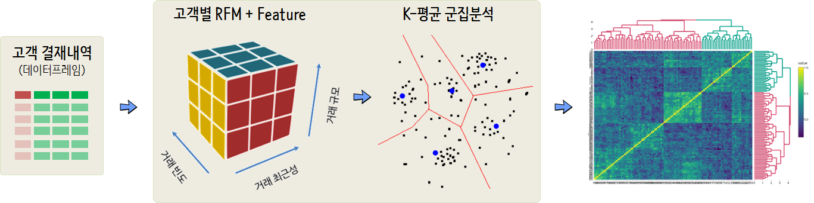

``` {r, include=FALSE}
# source("tools/chunk-options.R")
knitr::opts_chunk$set(echo = TRUE, warning=FALSE, message=FALSE,
                    comment="", digits = 3, tidy = FALSE, prompt = TRUE, fig.align = 'center')

```


# 온라인 유통점 거래 데이터 {#online-retail-dataset}

[UCI Machine Learning Repository - Online Retail Data Set](https://archive.ics.uci.edu/ml/datasets/online+retail)을 다운로드 받아 
인터랙티브 시각화를 통해 제품추천에 대한 인사이트를 얻을 수 있도록 한다.


# 고객 세그먼트 {#online-retail-product-recommendation}

온라인 유통 거래 데이터를 바탕으로 고객별로 RFM 위주로 Feature를 추출하고 이를 바탕으로 `K-평균` 군집분석을 수행하여 적절한 군집갯수를 만든 후에 각 군집마다 많이 구매하는 제품을 함수형 프로그래밍을 통해서 시각화한다. 
특히, 고급 추천 알고리즘을 제작하는 대신 기계와 인간이 공존하는 성공 모형을 만들고자 인터랙티브 시각화 기법을 접목시켜 고급 추천 알고리즘을 능가할 수 있는 데이터 과학제품을 제작하는 것을 목표로 삼아본다.



## 데이터 가져오기 {#online-retail-product-recommendation-import}

`readxl` 팩키지를 활용하여 `read_excel()` 함수로 온라인 소매점 거래 데이터를 불러읽어온다.
변수명을 정리하고 표본으로 100개만 뽑아서 원본 데이터를 살펴본다.

```{r online-retail-data}
library(tidyverse)
library(readxl)
library(janitor)

retail_dat <- read_excel("data/Online Retail.xlsx")

retail_df <- retail_dat %>% 
  clean_names() %>% 
  filter(!is.na(customer_id)) %>% 
  mutate(country_fct = fct_lump(country, 4)) %>% 
  mutate(amount = quantity * unit_price) %>% 
  select(-invoice_no, -country) 

retail_df %>% 
  sample_n(100) %>% 
  DT::datatable()
```


## 데이터와 사투 {#online-retail-product-recommendation-wrangling}

고객별 RFM을 만들기 위해서 기본 Feature 추출 작업을 수행한다.
그리고 나서 `rfm_df`라는 데이터프레임을 만들어서 `K-평균` 군집분석을 수행한다.
왜 `K-평균` 군집분석을 수행하는지 곰곰히 생각해 보기 바란다. 
정 궁금하면 [R Meetup X PRESSer](https://tidyverse-korea.github.io/r-meetup-x-presser/)에 와서 전문가에게 문의해도 좋을 듯 싶다.

```{r online-retail-data-wrangling}
now_dttm <- max(retail_df$invoice_date)

rfm_df <- retail_df %>% 
  group_by(customer_id) %>% 
  summarise(frequency = n(),
            monetary  = sum(amount),
            tenure = difftime(max(invoice_date), min(invoice_date), units = "day") %>% as.integer,
            recency = difftime(now_dttm, max(invoice_date), units = "day") %>% as.integer)
```


## 고객 세분화(Segment) {#online-retail-product-recommendation-segment}

`K-평균` 군집분석을 군집 알고리즘으로 삼고 군집 갯수 K를 팔꿈치 기준으로 삼아 7개로 군집갯수를 특정한다.

```{r online-retail-segment}
library(extrafont)
loadfonts()

retail_cluster_df <- rfm_df %>% 
  mutate(n_recency = scale(recency),
         n_frequency = scale(frequency),
         n_monetary  = scale(monetary),
         n_tenure  = scale(tenure)) %>% 
  select_if(str_detect(names(.), "n_"))

# 데이터 군집내 전체 제곱합 초기화: 0
set.seed(777)

retail_wss <- 0

# 군집을 1개부터 15개까지 증가
for (i in 1:15) {
    retail_out <- kmeans(retail_cluster_df, i, nstart=20, iter.max = 50)
    retail_wss[i] <- retail_out$tot.withinss
}

retail_wss_df <- tibble(
  cluster = 1:15,
  wss     = retail_wss
)

retail_wss_df %>% 
  ggplot(aes(x=cluster, y=wss)) +
    geom_point() +
    geom_line() +
    labs(x = "군집(Cluster) 갯수", 
         y = "WSS",
         title = "온라인 소매유통 군집(k) 선정",
         subtitle = " WSS: 군집내 전체 제곱합(Within groups sum of squares)") +
    theme_bw(base_family = "NanumGothic") +
    geom_point(data=data.frame(cluster = 7, wss = retail_wss_df$wss[7]), aes(x=cluster, y=wss), colour="red", size=5, shape = 1)

```

# 고객 세그먼트 제품 추천 {#online-retail-product-recommendation-segment-product}

`K-평균` 군집알고리즘으로 파악한 세분화된 고객 군집을 
국가와 결합하여 각 군집별 특성을 요약한 표를 작성한다.

```{r online-retail-segment-recommendation}
retail_kmeans <- kmeans(retail_cluster_df, 7, nstart=20, iter.max = 50)

rfm_df <- rfm_df %>% 
  mutate(cluster = retail_kmeans$cluster)

customer_stat_df <- retail_df %>% 
  group_by(customer_id) %>% 
  summarise(country = first(country_fct),
            product_type = n_distinct(stock_code),
            mean_price = mean(unit_price) %>% round(digits = 1),
            mean_quantity = mean(quantity) %>% round(digits = 1)) %>% 
  ungroup() %>% 
  left_join(rfm_df)

customer_segment_df <- customer_stat_df %>% 
  group_by(country, cluster) %>% 
  summarise(unit_price = mean(mean_price),
            unit_quantity = mean(mean_quantity),
            num_product = mean(product_type),
            size = n(),
            frequency = mean(frequency),
            monetary  = mean(monetary),
            tenure    = mean(tenure),
            recency   = mean(recency)) %>% 
  ungroup()

customer_segment_df %>% 
  DT::datatable() %>% 
  DT::formatRound(2:10, digits=0)
```

다음으로 각 군집에서 고객들이 많이 구입한 제품을 상위 10개를 뽑아 이를 시각화한다.
함수형 프로그래밍을 활용하여 각 고객 세그먼트에서 가장 많이 구매한 제품을 상위 10개 뽑아 인터랙티브하게 시각화해 둔다. 더블어 각 고객세그먼트를 나타낼 수 있도록 프로파일 측도도 함께 넣어둔다.


```{r online-retail-segment-recommendation-label, fig.width=10, fig.height=8}
retail_fp_tbl <- retail_df %>% 
  select(customer_id, description)

retail_fp_tbl <- customer_stat_df %>% 
  left_join(retail_df) %>% 
  select(country, cluster, description) %>% 
  group_by(country, cluster) %>% 
  nest()


plotly_df <- retail_fp_tbl %>% 
  mutate(cust_cart = map(data, ~count(data.frame(.$description), .$description, sort=TRUE))) %>% 
  mutate(top_items = map(cust_cart, ~top_n(., 10, wt=n))) %>% 
  mutate(top_tbl = map(.$top_items, ~paste0(.$`.$description`, ":", .$n), collapse="\n")) %>% 
  mutate(top_item = map_chr(top_tbl, str_flatten, collapse="\n"))

library(plotly)

plotly_df %>% 
  left_join(customer_segment_df) %>% 
  plot_ly(y=~cluster, x=~country,  z = ~monetary, type = "heatmap",
          hoverinfo = "text",
          text = ~paste("* 고객수: ", round(size,0), "<br>",
                        "* 구매빈도: ", round(frequency,0), "<br>",
                        "* 고객신분기간(일): ", round(tenure,0), "<br>",
                        "* 최근방문(일): ", round(recency,0), "<br>",
                        "* 인기구매아이템(내림차순): \n", top_item))  %>% 
  layout(yaxis = list(title = "클러스터"),
         xaxis = list(title = "국가"))
```
