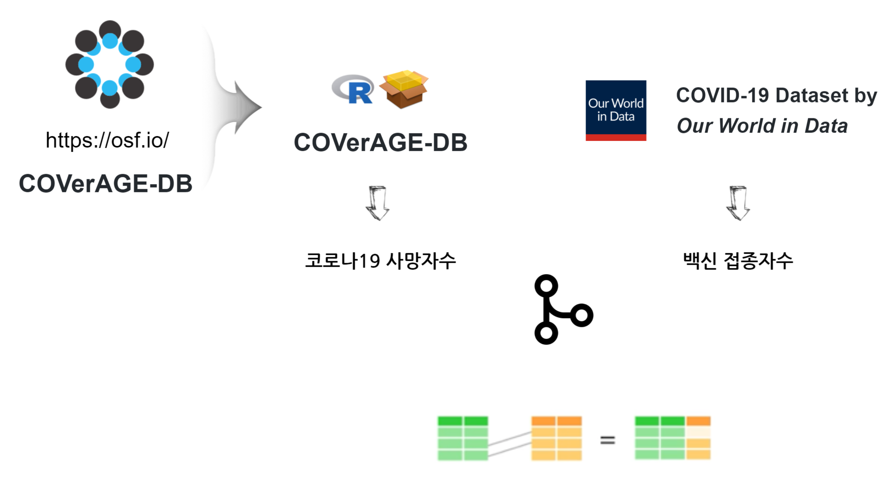

```{r setup, include=FALSE}
knitr::opts_chunk$set(echo = TRUE, warning=FALSE, message=FALSE,
                    comment="", digits = 3, tidy = FALSE, prompt = FALSE, fig.align = 'center')

library(tidyverse)
library(scales)
library(showtext) # 글꼴, install.packages("showtext")
library(extrafont)
loadfonts()
```



# 사망자와 백신 데이터 {#death-vaccine-dataset}

코로나 19로 인한 사망자 데이터를 [COVerAGE-DB: A database of COVID-19 cases and deaths by age](https://osf.io/mpwjq/) 데이터가 공개되어 코로나19로 인한 사망에 대한 데이터가 공개 되어 있으며, [COVerAGE-DB - R 팩키지](https://github.com/timriffe/covid_age)가 있어 바로 데이터를 분석할 수 있도록 실시간으로 정보를 제공하고 있다.

코로나 19 백신 접종자수에 대한 데이터는 [Our World in Data](https://github.com/owid) 에서 [COVID-19 Dataset by Our World in Data](https://github.com/owid/covid-19-data) GitHub 저장소를 통해 획득할 수 있다.

코로나 19로 인한 사망자와 코로나 백신 접종자수 두 데이터를 교차함으로써 백신에 대한 효과를 파악할 수 있다.

## 백신 데이터 {#vaccine-dataset}

코로나 19 백신 접종자수에 대한 데이터를 [COVID-19 Dataset by Our World in Data](https://github.com/owid/covid-19-data) GitHub 저장소에서 바로 가져온다.

```{r vaccine-data}
library(tidyverse)
library(countrycode)
library(lubridate)
library(extrafont)
loadfonts()

download.file(url = "https://raw.githubusercontent.com/owid/covid-19-data/master/public/data/vaccinations/vaccinations.csv", 
              destfile = "data/vaccinations.csv")

vaccine <- read_csv("data/vaccinations.csv",
                    col_types= "ccDddddddddd")

vaccine_tbl <- vaccine %>% 
  mutate(ISO2 = countrycode(iso_code,
                             origin = 'iso3c',
                             destination = 'iso2c')) %>%
  select(location,
         ISO2,
         date,
         total_vaccinations,
         people_vaccinated,
         people_fully_vaccinated,
         daily_vaccinations_raw) %>% 
  # filter(str_detect(ISO2, "KR|JP|US|GB")) %>%
  filter(str_detect(ISO2, "KR|JP|TW|GB|US")) %>% 
  group_by(ISO2) %>% 
  arrange(date) %>% 
  mutate(total_vaccinations = zoo::na.locf(total_vaccinations)) %>% 
  select(date, ISO2, country = location, vaccinations = total_vaccinations) %>% 
  ungroup()

vaccine_tbl %>% 
  reactable::reactable()
```

## 사망자 데이터 {#death-dataset}

[COVerAGE-DB - R 팩키지](https://github.com/timriffe/covid_age)에서 상기 주요 5개국에 대한 사망자 데이터를 다운로드 한다.

```{r death-data}
# remotes::install_github("eshom/covid-age-data")
library(covidAgeData)


# inputDB <- download_covid("inputDB", progress = TRUE)
inputDB <-  read_csv("inputDB.zip",
                     skip = 1,
                     col_types = "cccccciccdc")

death_tbl <- subset_covid(inputDB, 
                         Country = c("South Korea", "USA", "Japan", "United Kingdom", "Taiwan"), 
                         Region = "All") %>% 
  # 변수명과 자료형 작업
  as_tibble() %>% 
  janitor::clean_names(.) %>% 
  mutate(date = dmy(date)) %>% 
  # 분석에 필수 변수만 추리는 작업
  select(date, country, measure, value) %>% 
  # 변수 가독성 향상 작업
  mutate(measure = ifelse(measure == "Cases", "확진", "사망"))  %>% 
  filter(measure == "사망") %>% 
  mutate(ISO2 = countrycode(country, origin = 'country.name', destination = 'iso2c')) %>% 
  select(date, ISO2, country, death = value)

death_tbl
```

## 데이터 결합 {#merge-death-vaccine}

코로나19 사망자수와 백신 접종자수를 주요 5개국을 기준으로 결합시켜 후속 시각화와 데이터 분석을 위해 준비한다.

```{r merge-vaccine-data}
merge_tbl <- left_join(death_tbl, vaccine_tbl, by = c("ISO2", "date", "country")) %>% 
    mutate(country_kor  = case_when(str_detect(country, "Korea") ~ "한국",
                              str_detect(country, "United States") ~ "미국",
                              str_detect(country, "United Kingdom") ~ "영국",
                              str_detect(country, "Japan") ~ "일본",
                              str_detect(country, "Taiwan") ~ "대만"))


merge_tbl
```


# 정적 그래프 {#vaccine-dataset-graph}


```{r vaccine-data-graph}
library(gganimate)

merge_tbl %>% 
  count(country)

vaccine_g <- merge_tbl %>% 
  filter(date >= lubridate::ymd("2021-01-01")) %>% 
  ggplot(aes(x = date, y = vaccinations, color = country, group = country)) +
    geom_line() +
    geom_point() +
    geom_text(aes(label = country, family = "NanumGothic"), hjust = -0.3, size = 3.5) +
    scale_y_continuous(labels = scales::comma) +
    scale_x_date(date_labels = "%y-%m-%d") +
    theme_bw(base_family = "NanumGothic") +
    labs(title = "코로나19 일별 접종자수",
         x = "", 
         y = "백신 접종자수",
         color = "국가") +
    theme(legend.position = "top")

vaccine_g
```

# 애니메이션 [^1] {#vaccine-dataset-animation}

[^1]: [Katherine Goode, "gganimate (with a spooky twist)", ISU Graphics
    Group - October 31,
    2019](https://goodekat.github.io/presentations/2019-isugg-gganimate-spooky/slides.html#1)

```{r vaccine-data-animation, eval  = FALSE}
library(gganimate)

vaccine_g + transition_reveal(along = date)

```
