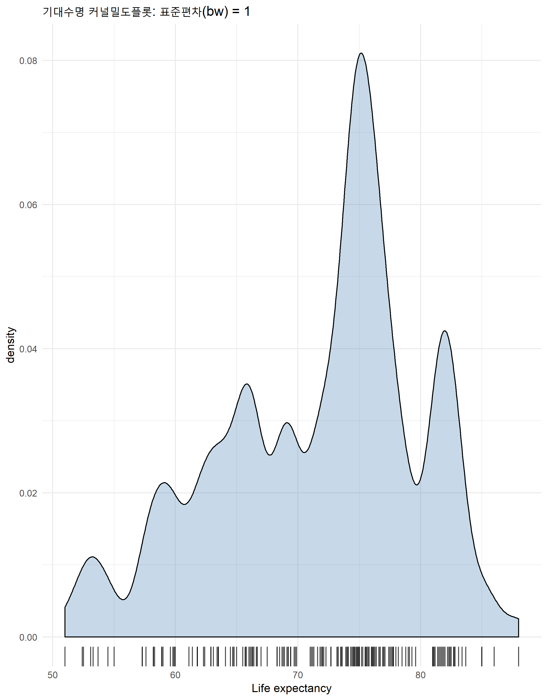

``` {r, include=FALSE}
# source("tools/chunk-options.R")
knitr::opts_chunk$set(echo = TRUE, warning=FALSE, message=FALSE,
                    comment="", digits = 3, tidy = FALSE, prompt = TRUE, fig.align = 'center')

library(here)
```


# 세계보건기구 기대수명 데이터셋 {#who-api}

[rgho - Access WHO Global Health Observatory Data From R](https://github.com/pierucci/rgho), [Programmatic Data Retrieval from the World Health Organization](https://github.com/expersso/WHO) 두 API를 통해서 WHO 데이터를 다운로드 받을 수 있다.

[캐글 기대수명(WHO)](https://www.kaggle.com/kumarajarshi/life-expectancy-who/home) 데이터셋이 준비되어서 이를 바로 활용한다.

- Country: Country
- Year: Year
- Status: Developed or Developing status
- Life expectancy:  Life Expectancy in age
- Adult Mortality: Adult Mortality Rates of both sexes (probability of dying between 15 and 60 years per 1000 population)
- infant deaths: Number of Infant Deaths per 1000 population
- Alcohol: Alcohol, recorded per capita (15+) consumption (in litres of pure alcohol)
- percentage expenditure: Expenditure on health as a percentage of Gross Domestic Product per capita(%)
- Hepatitis B: Hepatitis B (HepB) immunization coverage among 1-year-olds (%)
- Measles: Measles - number of reported cases per 1000 population
- BMI: Average Body Mass Index of entire population
- under-five deaths: Number of under-five deaths per 1000 population
- Polio: Polio (Pol3) immunization coverage among 1-year-olds (%)
- Total expenditure: General government expenditure on health as a percentage of total government expenditure (%)
- Diphtheria: Diphtheria tetanus toxoid and pertussis (DTP3) immunization coverage among 1-year-olds (%)
- HIV/AIDS: Deaths per 1 000 live births HIV/AIDS (0-4 years)
- GDP: Gross Domestic Product per capita (in USD)
- Population: Population of the country
- thinness 1-19 years: Prevalence of thinness among children and adolescents for Age 10 to 19 (% )
- thinness 5-9 years: Prevalence of thinness among children for Age 5 to 9(%)
- Income composition of resources: Human Development Index in terms of income composition of resources (index ranging from 0 to 1)
- Schooling: Number of years of Schooling(years)

```{r who-dataset}
# 0. 환경설정 -----
library(tidyverse)

# 1. 데이터 -----
who_df <- read_csv("data/Life Expectancy Data.csv")

```

# 비율 시각화 {#who-dataset-proportion}

전체를 100으로 놓았을 때 이를 비율로 시각화하는 사례가 많다. 특히, 원그래프(pie chart)를 통해 시각화를 많이 하는데 연구를 통해서 이에 대한 반성도 있고 한다.

## 원그래프 {#who-dataset-proportion-pie}

캐글 WHO 데이터에서 비율로 적합한 척도가 국가를 `Status` 필드에서 선진국(Developed)과 개발도상국(Developing)으로 구분하고 있어 이를 먼저 원그래프로 시각화한다.
우선 가장 최근 연도 (2015)를 추출하고 이를 바로 `ggplot`에 넣어서 `geom_bar` 그래프로 막대그래프를 만들고, `coord_polar(theta = "y")`를 통해 원그래프로 변환시킨다.
그리고 배경을 `theme_void`로 깔끔히 정리하면 된다.

```{r data-proportion-pie}
who_df %>% 
  filter(Year == max(Year)) %>% 
  ggplot(aes(x=1, fill=Status)) +
    geom_bar(color="white") +
    coord_polar(theta = "y") +
    theme_void() +
    labs(fill="국가구분")

```

## 와플 그래프 {#who-dataset-proportion-waffle}

하지만, 대략적인 비율은 개발도상국이 많다는 것은 알겠는데 직관적으로 비율이 얼마인지 파악하는 것은 쉽지 않다.
이에 대한 대안으로 와플(waffle) 그래프가 있다.

```{r data-proportion-waffle}
library(waffle)

status_df <- who_df %>% 
  filter(Year == max(Year)) %>% 
  count(Status)

status_v <- status_df %>% pull(n)
names(status_v) <- status_df$Status

waffle(status_v, rows = 10, title="선진국과 개발도상국")
```

# 국가간 비율 비교 {#who-dataset-proportion-by-country}

국가가 너무 많아 임의로 국가를 선택하여 디프테리아와 홍역(Measles) 발병건수를 국가별로 비교할 수 있도록 
비율 막대그래프(Stacked Barchart)를 작성한다.

```{r who-comparison-by-country}
country_name_v <- c("Belgium", "Canada", "Chile", "China", "France", 
"Germany", "Greece", "Israel", "Italy", "Jamaica", "Japan", "Mongolia", 
"Republic of Korea", "Russian Federation", "Rwanda", "Spain", "United States of America","Viet Nam", "Yemen")

# random_country_name_v <- sample(unique(who_df$Country), 15)

who_df %>% 
  filter(Country %in%country_name_v, Year == 2015) %>%
  # filter(Country %in% random_country_name_v, Year == 2015) %>%
  select(Country, Status, Measles,  `Diphtheria`) %>% 
  gather(disease, cases, -Country, -Status) %>% 
  ggplot(aes(x=fct_reorder(Country, cases), y=cases, fill = disease)) +
    geom_col(position = "fill") +
    coord_flip() +
    labs(x="", y="", title="주요국가 디프테리아, 홍역 질병 비교") 
```

# 점 데이터 {#who-dataset-point-dataset}

점 데이터(Point Data)는 한축에는 범주형 데이터, 다른 축에는 연속형 데이터가 존재하는 형태로 일상적으로 많이 볼 수 있다.
이를 위해서 막대그래프를 많이 사용하는데, 사람은 막대그래프의 아래쪽 공간보다 위쪽 빈공간에 관심을 덜 둔다.
이를 옆으로 돌려도 비슷하다.

## 막대 그래프 {#who-dataset-point-dataset-barplot}

먼저 점 데이터를 막대그래프로 작성한다. 국가를 15개 뽑아서 막대그래프로 그리게 되면 국가명이 겹치게 된다.
이를 방지하기 위해서 옆으로 돌리고 나서 기대수명이 들쭉날쭉하기 때문에 가장 기대수명이 높은 국가를 맨 위에 위치하고 정렬하는 방식으로 
그래프를 정리하는데 `fct_reorder` 함수를 사용한다.

```{r point-data-barplot}
random_country_name_v <- sample(unique(who_df$Country), 15)

who_df %>% 
  filter(Country %in% random_country_name_v, Year == 2015) %>%
  ggplot(aes(x=fct_reorder(Country, `Life expectancy`), y=`Life expectancy`)) +
    geom_col(width = 0.3) +
    coord_flip() +
    labs(x="", y="기대수명(Life Expectancy)")

```

## 점그래프 [^lollipop-plot-r-journalism] {#who-dataset-point-dataset-point}

[^lollipop-plot-r-journalism]: [Andrew Ba Tran (2018), "R FOR JOURNALISTS"](https://learn.r-journalism.com/en/visualizing/customizing_charts/customizing-exporting-ggplot2/)

막대 그래프는 상대적으로 공간을 많이 차지해서 독자가 피곤할 수 있어 점으로 표현하는 것도 한 방법이다.
이를 위해서 `geom_point()`를 사용하고, `geom_segment()`도 사용해서 보조선을 추가해서 가독성을 높인다.

```{r point-data-point}
who_df %>% 
  filter(Country %in% random_country_name_v, Year == 2015) %>%
  ggplot(aes(y=fct_reorder(Country, `Life expectancy`), x=`Life expectancy`)) +
    geom_point(size = 3) +
    geom_segment(aes(x = 0, xend = `Life expectancy`,
                     yend = fct_reorder(Country, `Life expectancy`)),
                 color = "gray50",
                 size=1) +
    labs(y="", x="기대수명(Life Expectancy)") +
    theme_minimal()

```

# 분포 시각화 {#who-dataset-point-dataset-distribution}

## 히스토그램 {#who-dataset-point-dataset-distribution-hist}

히스토그램은 단변량 데이터의 분포를 시각화하는 가장 첫번째 시각화가 된다.
하지만, 적절한 빈(bin) 갯수를 찾는 것이 문제다. 만약 관측점(`n`)이 200보다 크면 빈갯수는 100개로 하고 
200보다 적은 경우 적절한 빈갯수를 선택한다.

```{r who-distribution-histogram}

for(i in seq(30,100,5)) {
  who_df %>% 
    filter(Year == max(Year)) %>% 
      ggplot(aes(x=`Life expectancy`)) +
        geom_histogram(bins=i) +
        labs(title=paste0("기대수명 히스토그램: 빈(bins) = ", i))
  ggsave(file=paste0("data/hist_", i,".png"))
}

library(magick)

list.files("data/", pattern = ".png$", full.names = TRUE) %>% 
  map(image_read) %>%
  image_join() %>% 
  image_animate(fps=1) %>% 
  image_write("data/hist_bins.gif")
```




## 밀도 그래프 {#who-dataset-point-dataset-distribution-density}

히스토그램의 대안으로 KDE(Kernel Density Estimator)를 이용하는 커널 밀도 플롯(Kernel Density Plot)을 시각화하는데 사용한다.
정규분포를 커널로 사용하기 때문에 중요 모수인 표준편차(`bw`)를 설정해줘야 한다.
또한 `geom_rug()`도 사용해서 실제 관측점이 어느 지점에 밀집되어 있는지 시각적으로 파악한다.

```{r who-distribution-density}
who_df %>% 
  filter(Year == max(Year)) %>% 
    ggplot(aes(x=`Life expectancy`)) +
      geom_density(fill='steelblue', alpha=0.3) +
    theme_minimal() +
    geom_rug(alpha=0.7)

```

기대수명 `Life expectancy` 변수에 대해서 결측값을 제외하고 표준편차가 `who_df %>% summarise(sd(`Life expectancy`, na.rm=TRUE)) %>% pull`이라
이를 중심으로 표준편차 변화에 따른 커널 밀도 플롯 변화를 살펴보자.

```{r who-distribution-density-ani}
for(i in seq(1, 15, 1)) {
  who_df %>% 
    filter(Year == max(Year)) %>% 
      ggplot(aes(x=`Life expectancy`)) +
        geom_density(fill='steelblue', alpha=0.3, bw=i) +
      theme_minimal() +
      geom_rug(alpha=0.7) +
      labs(title=paste0("기대수명 커널밀도플롯: 표준편차(bw) = ", i))
  ggsave(file=paste0("data/density_", i,".png"))
}

list.files("data/", pattern = "^density", full.names = TRUE) %>% 
  map(image_read) %>%
  image_join() %>% 
  image_animate(fps=1) %>% 
  image_write("data/density_bw.gif")
```


# 집단간 분포 비교 {#who-dataset-point-dataset-distribution-comparison}

집단간 분포를 비교할 때 가장 첫번째 사용되는 것이 상자그래프(boxplot)다. 
여기에 `geom_jitter`를 추가하면 상자그림에서 놓일 수 있는 면을 시각적으로 보여줄 수도 있다.

```{r density-comparison-who}
who_df %>% 
  filter(Year == max(Year)) %>% 
    ggplot(aes(y=`Life expectancy`, x=Status)) +
      geom_boxplot(alpha=0) +
    theme_minimal() +
    geom_jitter(alpha =0.3, color="steelblue") +
    labs(x="", y="기대수명", title="선진국과 개도국 기대수명 비교")
```

## 벌떼 그래프 {#who-dataset-point-dataset-distribution-beeswarm}

`geom_jitter()`의 대안으로 벌떼 그래프가 대안이 될 수 있다.
상자그래프와 함께 사용할 경우 선진국, 개도국 기대수명 분포에 대해서 좀더 명확히 확인이 될 수 있도록한다.

```{r density-comparison-who-beeswarm}
library(ggbeeswarm)

who_df %>% 
  filter(Year == max(Year)) %>% 
    ggplot(aes(y=`Life expectancy`, x=Status)) +
      geom_boxplot(alpha=0) +
      theme_minimal() +
      geom_beeswarm(alpha =0.3, color="steelblue") +
      labs(x="", y="기대수명", title="선진국과 개도국 기대수명 비교")
```

## 바이올린 그래프 {#who-dataset-point-dataset-distribution-violin}

`geom_beeswarm`도 문제가 데이터가 많아지면 점을 찍기가 어렵고 오히려 시각화에 방해가 된다.
이를 위해서 바이올린 그래프를 사용하는 것이 도움이 된다.

```{r density-comparison-who-violin}
who_df %>% 
  filter(Year == max(Year)) %>% 
    ggplot(aes(y=`Life expectancy`, x=Status)) +
      geom_violin(fill="lightgreen") +
      theme_minimal() +
      geom_beeswarm(alpha =0.3, color="steelblue") +
      labs(x="", y="기대수명", title="선진국과 개도국 기대수명 비교")
```


## 하나로 합쳐보자 {#who-dataset-point-dataset-distribution-all}

즉 상자그래프(boxplot)을 통해서 기술통계량(중위수, 분위수 등)도 함께 시각적으로 넣어주고,
기대수명에 대한 각국도 점으로 표현하고 바이올린 그래프를 통해서 분포도 왜곡없이 표현해보자.

```{r density-comparison-who-violin-combined}
who_df %>% 
  filter(Year == max(Year)) %>% 
    ggplot(aes(y=`Life expectancy`, x=Status)) +
      geom_boxplot(width=0.2) +
      geom_violin(fill="lightgreen", alpha=0.3) +
      theme_minimal() +
      geom_beeswarm(alpha =0.3, color="steelblue") +
      labs(x="", y="기대수명", title="선진국과 개도국 기대수명 비교")
```


# 순서를 고려한 능선 그래프 {#who-dataset-point-dataset-ridge}

연도와 마찬가지로 순서가 있는 경우 밀도 능선 그래프를 통해서 연도별 변화를 시각적으로 파악하는데 도움이 된다.

```{r who-ridge}
library(ggridges)

who_df %>% 
    ggplot(aes(x=`Income composition of resources`, y=Year, group=Year)) +
      geom_density_ridges(bandwidth = 0.062) +
      theme_minimal() 

```

